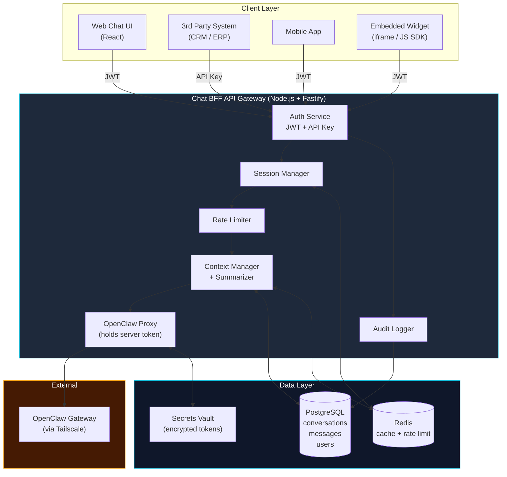
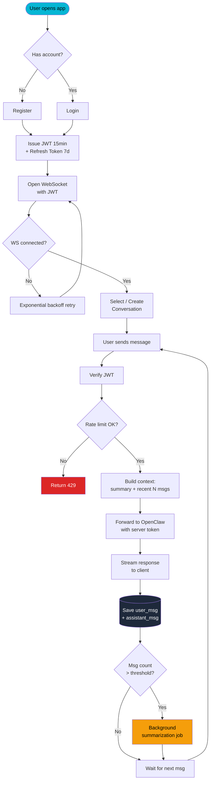
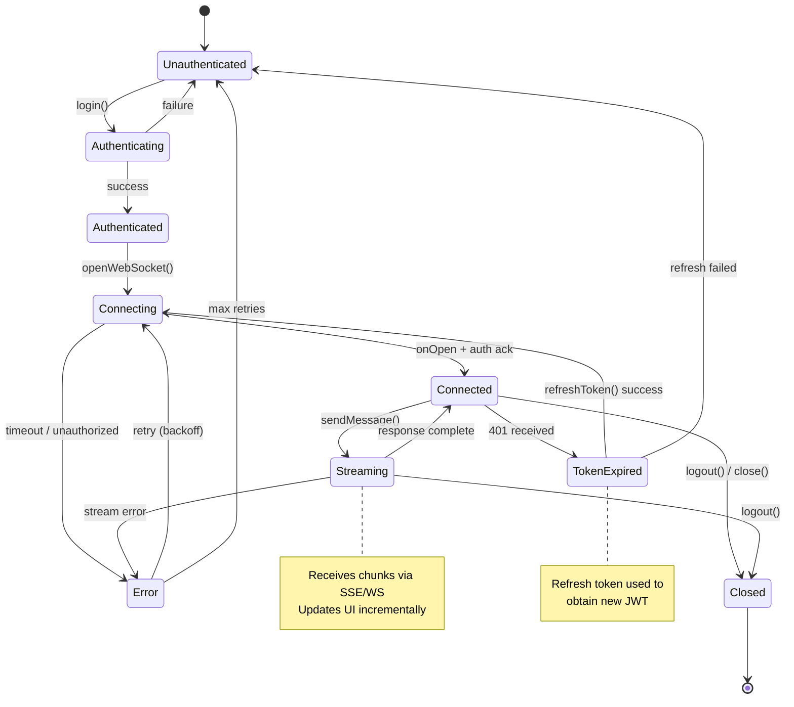
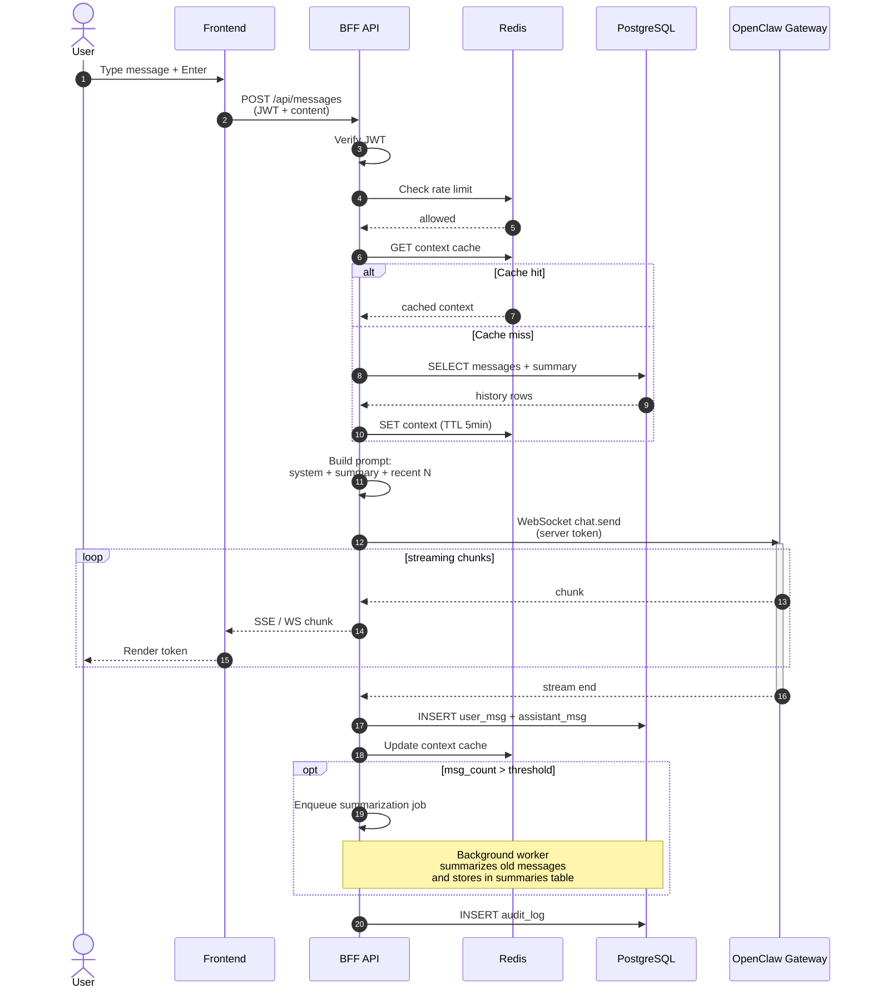
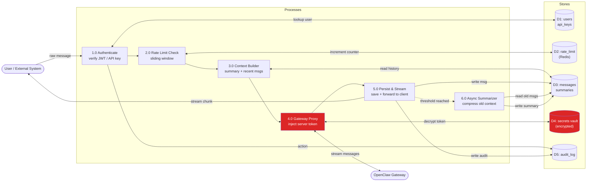
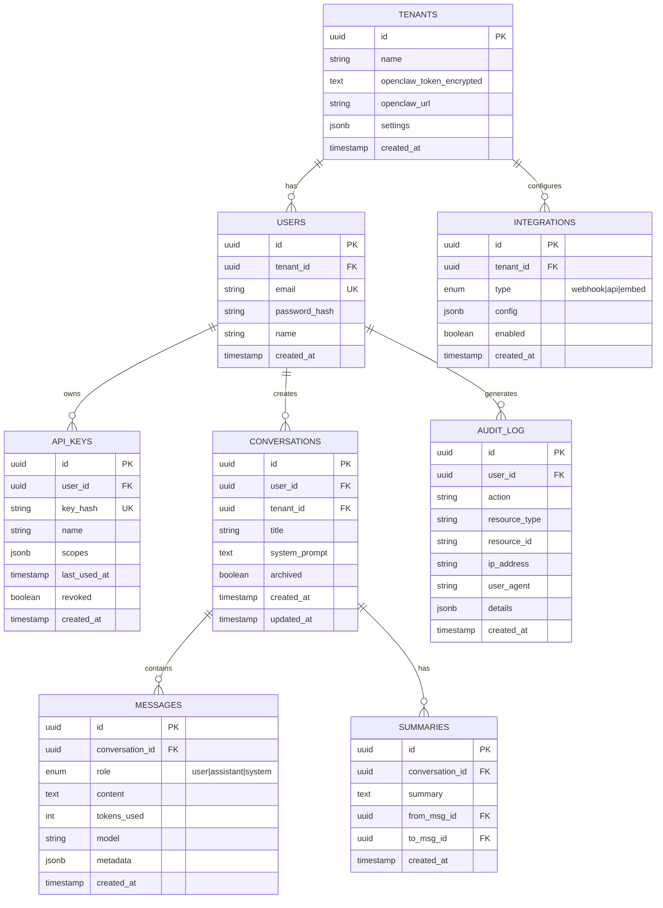
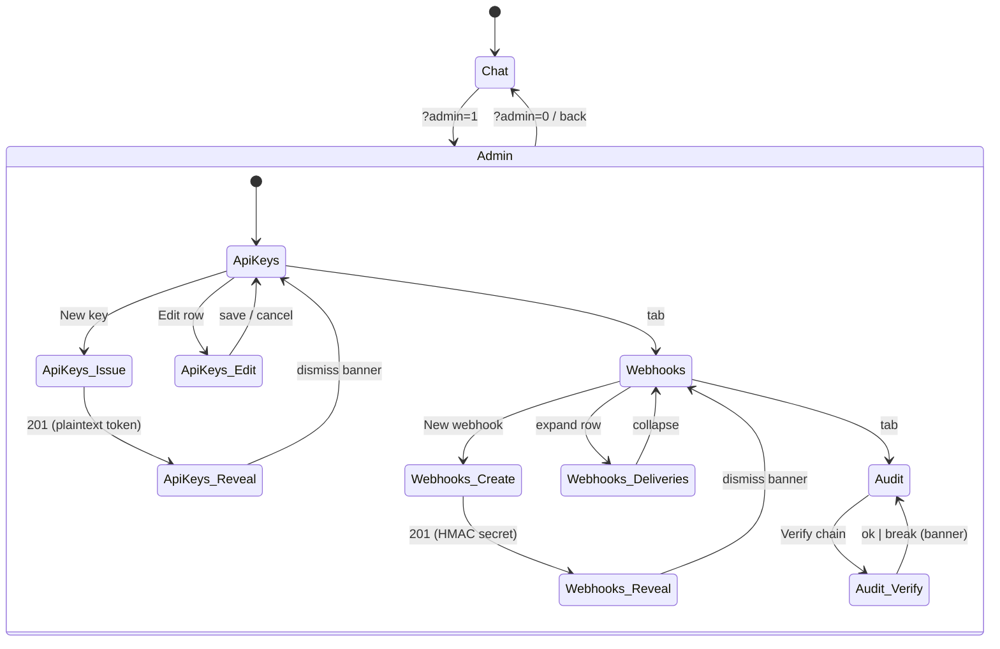
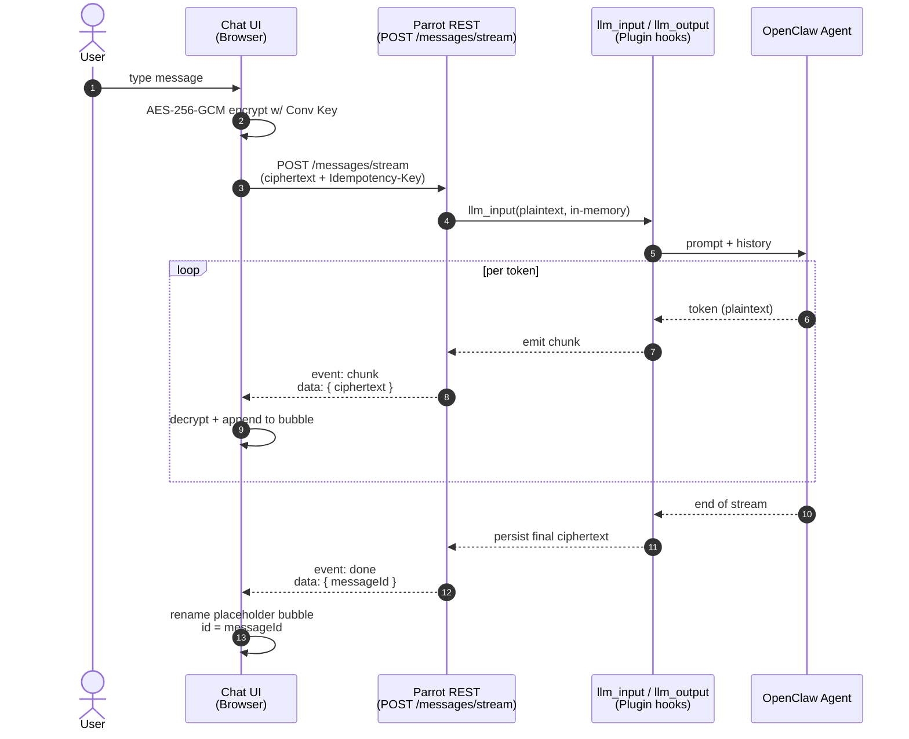

# GateForge Parrot — Architecture

A secure, embeddable chat platform that proxies OpenClaw Gateway, manages conversations, and exposes a standardized API for third-party integrations.

---

## Table of Contents

1. [High-Level Architecture](#high-level-architecture)
2. [Workflow Diagram](#workflow-diagram)
3. [State Diagram](#state-diagram)
4. [Sequence Diagram](#sequence-diagram)
5. [Data Flow Diagram](#data-flow-diagram)
6. [ER Diagram](#er-diagram)
7. [Tech Stack](#tech-stack)
8. [Project Structure](#project-structure)
9. [Implementation Phases](#implementation-phases)

---

## High-Level Architecture



---

## Workflow Diagram

End-to-end user journey from registration to multi-turn conversation.



---

## State Diagram

Connection and session lifecycle for the chat client.



---

## Sequence Diagram

Message send flow with context management and persistence.



---

## Data Flow Diagram

DFD Level 1 — how data moves through the system.



---

## ER Diagram

Database schema for multi-tenant chat platform.



**Key relationships:**

- **TENANTS** — Multi-tenant support; each tenant owns encrypted OpenClaw credentials
- **USERS** — Belong to a tenant; can create multiple conversations
- **API_KEYS** — Scoped credentials for third-party system integration (`chat:send`, `chat:read`, etc.)
- **CONVERSATIONS** — Hold messages and rolling summaries
- **SUMMARIES** — Compressed history for long conversations (context window management)
- **AUDIT_LOG** — Immutable record of sensitive operations
- **INTEGRATIONS** — Webhook endpoints and embed configurations

---

## Tech Stack

### Backend (BFF)

| Component | Choice | Rationale |
|-----------|--------|-----------|
| Runtime | Node.js 20 + TypeScript | Familiar TS, mature ecosystem |
| Framework | Fastify | 2–3× faster than Express, native schema validation |
| WebSocket | `@fastify/websocket` | First-class Fastify integration |
| Auth | JWT (jose) + bcrypt + Refresh Token | Industry standard |
| ORM | Drizzle ORM | TypeScript-first, migration-friendly |
| Validation | Zod | End-to-end type safety |
| Secret Management | `node-vault` or env vars + KMS | Encrypt OpenClaw tokens at rest |

### Data Layer

| Component | Choice | Rationale |
|-----------|--------|-----------|
| Primary DB | PostgreSQL 16 | Familiar; jsonb, full-text search |
| Cache | Redis 7 | Session, rate limit, context cache |
| Vector Search (optional) | pgvector | Future semantic search over long conversations |

### Frontend

| Component | Choice |
|-----------|--------|
| Framework | React 18 + TypeScript + Vite |
| UI | Tailwind + shadcn/ui |
| State | TanStack Query + Zustand |
| WebSocket Client | Native WebSocket + auto-reconnect |
| Markdown | react-markdown + highlight.js |

### DevOps

| Component | Choice |
|-----------|--------|
| Containerization | Docker + docker-compose |
| Reverse Proxy | Nginx or Caddy (auto HTTPS) |
| Process Mgmt | systemd or Docker `restart: always` |
| Logging | Pino → file + optional Grafana Loki |
| Monitoring | Prometheus + Grafana (optional) |

### Security

- **Token encryption** — OpenClaw token stored AES-256-GCM encrypted, key from env/KMS
- **Rate limiting** — Redis sliding window, per-user quota
- **CORS** — Strict allowlist
- **CSP headers** — XSS mitigation
- **API key scopes** — Fine-grained (`chat:send`, `chat:read`, `conversations:create`)
- **Audit log** — All write operations recorded

### Third-Party Integration Methods

| Method | Use Case |
|--------|----------|
| REST API + API Key | Backend-to-backend (CRM, ERP) |
| JS SDK + Embed Widget | One-line web embed |
| Webhook | Outbound event push |
| iframe Embed | Simplest embed |

---

## Project Structure

```
gateforge-parrot-openclaw/
├── packages/
│   ├── backend/              # Fastify BFF
│   │   ├── src/
│   │   │   ├── routes/       # REST + WS endpoints
│   │   │   ├── services/     # auth, chat, context, summarizer
│   │   │   ├── db/           # Drizzle schema + migrations
│   │   │   └── lib/          # OpenClaw client, crypto, redis
│   │   └── package.json
│   ├── frontend/             # React Web Chat UI
│   ├── sdk/                  # JS SDK for embedding
│   └── shared/               # Shared TypeScript types
├── docker-compose.yml        # PG + Redis + backend + frontend
├── nginx.conf
├── ARCHITECTURE.md           # This file
└── README.md
```

---

## Implementation Phases — Current State

| Phase | Scope | Status |
|-------|-------|--------|
| **Phase 0 — Design** | Architecture + SECURITY + USER_JOURNEYS + crypto PoC | ✅ Shipped |
| **Phase 1 — MVP** | Plugin skeleton, manifest, DB migration, JWT auth, bundled React UI | ✅ Shipped |
| **Phase 2 — Integration API** | Sessions + scoped API keys + webhooks + SSE streaming + rate limiting + idempotency + OpenAPI 3.1 + SDK + 29 endpoints, drift-checked | ✅ Shipped |
| **Phase 3 — Admin UI** | Three-tab admin panel (`?admin=1`) + assistant SSE streaming in the chat UI + audit chain verifier | ✅ Shipped |
| **Phase 4 — Embed** | `<script>` drop-in widget + iframe host SDK + postMessage bridge | ⏳ Next |
| **Phase 5 — Tooling** | Audit log verification CLI + password recovery via Shamir shards | ⏳ Planned |
| **Phase 6 — Distribution** | Publish to ClawHub registry + npm release of `@gateforge/parrot-sdk` | ⏳ Planned |

### Phase 3 — Admin panel state machine

The admin panel lives at `/gateforge-parrot/ui?admin=1` and shares the chat UI's JWT session. Tab state is local; one-time secrets (API key plaintext, webhook HMAC seed) are revealed exactly once in a banner and never persisted.



### Phase 3 — SSE streaming sequence

The bundled chat UI now streams assistant tokens through `POST /conversations/:id/messages/stream`. Plaintext exists only in OpenClaw's process for the lifetime of the request — every frame is re-encrypted with the conversation key before it hits the wire.



---

## How to Render These Diagrams

All diagrams in this document use **Mermaid** syntax.

- **GitHub / GitLab** — render natively in Markdown previews
- **Notion** — paste as `/code` block with language `mermaid`
- **VS Code** — install `Markdown Preview Mermaid Support` extension
- **Live editor** — [mermaid.live](https://mermaid.live) for interactive editing
- **CLI export** — `npm install -g @mermaid-js/mermaid-cli` then `mmdc -i ARCHITECTURE.md -o out.pdf`

---

*Architecture document for the GateForge Parrot — secure proxy + persistence layer over OpenClaw Gateway.*
