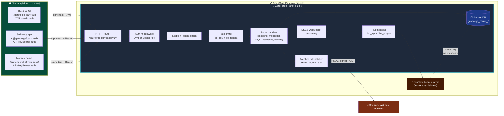
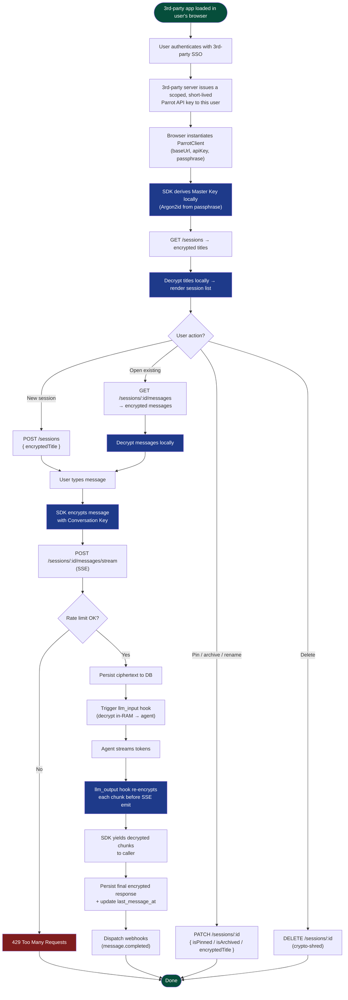
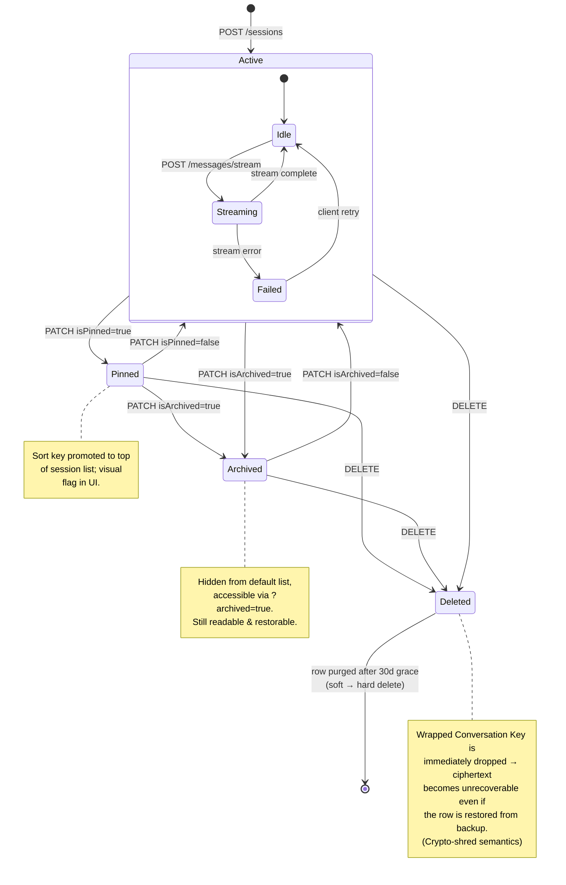
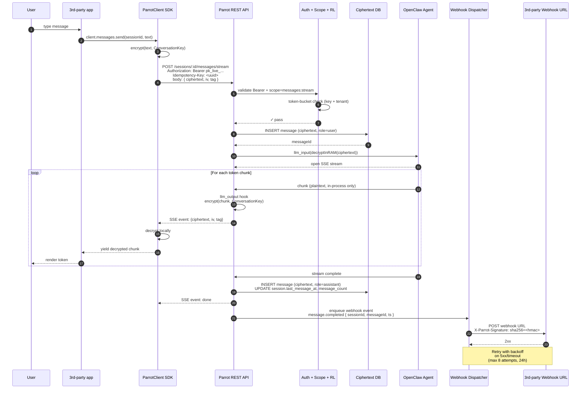
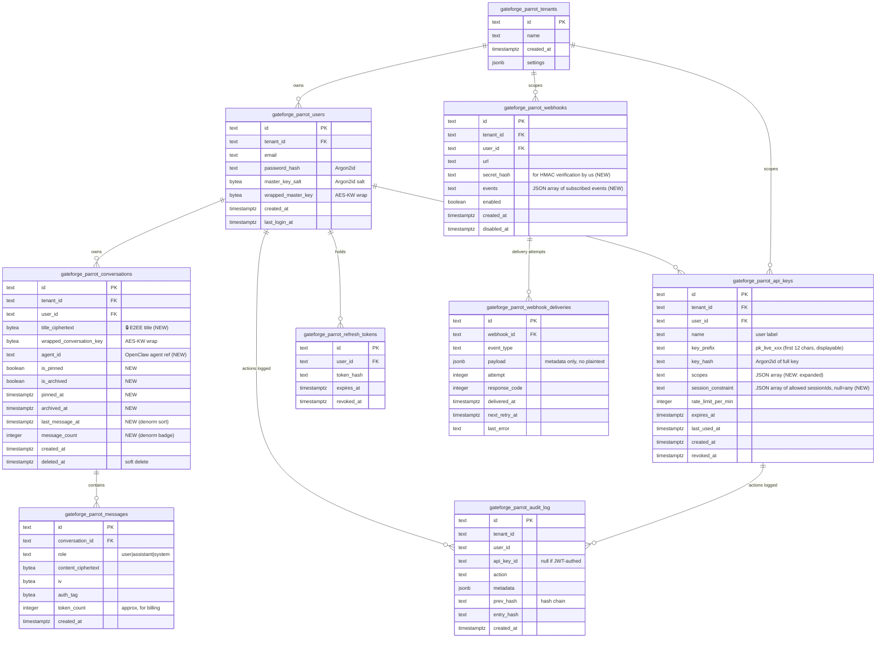
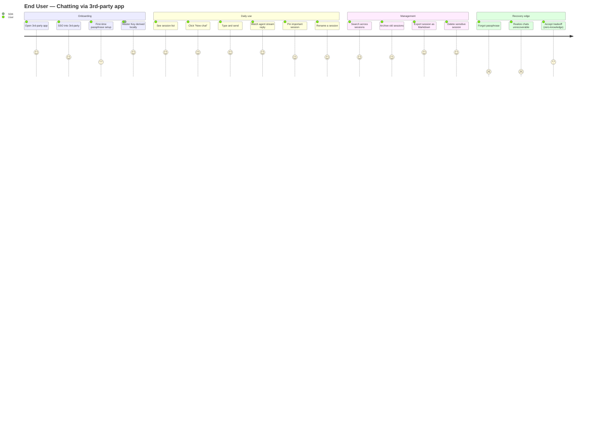
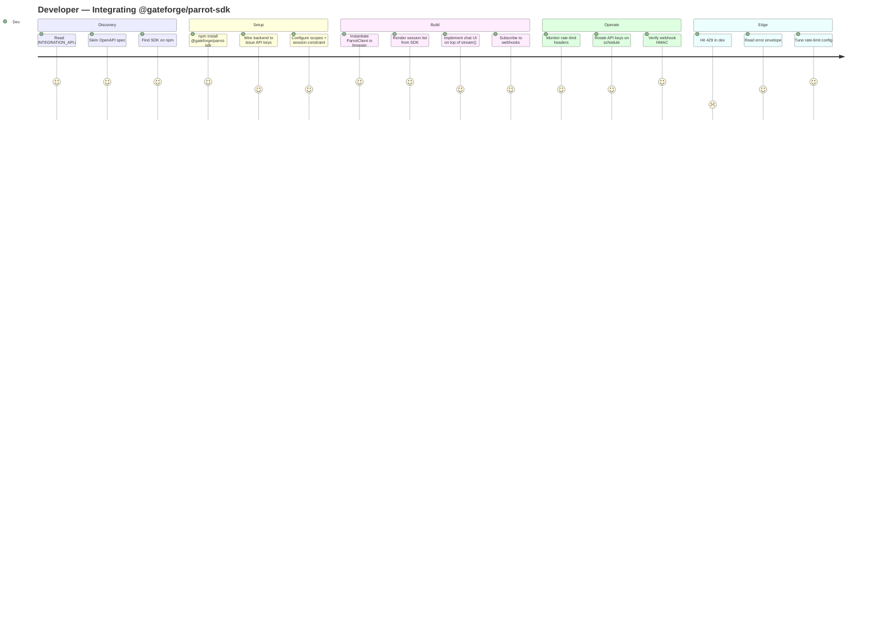
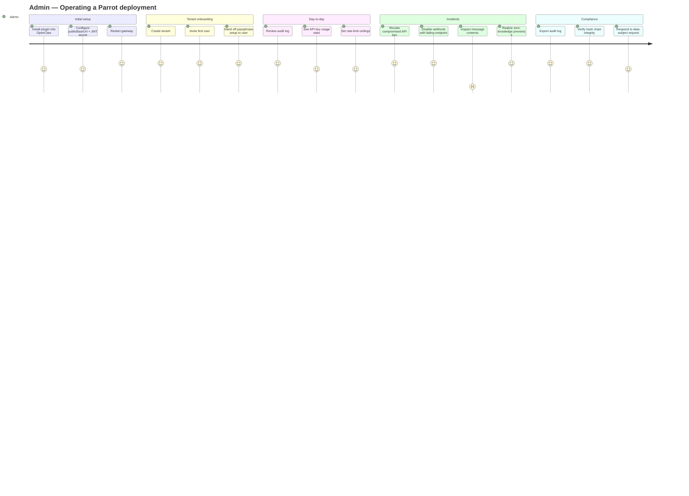
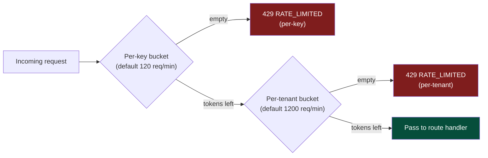

# GateForge Parrot — Integration API & Session Management Design

> **Status:** Design draft for review. No code written until this document is approved.
> **Phase:** 2 (covers 2a–2g + chat session management)
> **Last updated:** May 16, 2026

---

## 1. Goals

Phase 2 turns the GateForge Parrot plugin from a "single bundled UI" into a **fully integratable chat platform** that any 3rd party can embed into their own application, while preserving the zero-knowledge end-to-end encryption promise from Phase 0.

### In scope

- **Chat session management** — list / create / rename / pin / archive / delete / search / export
- **Scoped API keys** — multi-tenant, least-privilege, revocable Bearer tokens
- **REST API** — full surface for sessions + messages + agents
- **SSE streaming** — token-by-token agent responses
- **JavaScript SDK** — `@gateforge/parrot-sdk` (npm, reference implementation)
- **Webhooks** — outbound HMAC-signed event delivery
- **Rate limiting** — per-key and per-tenant token buckets
- **Static OpenAPI 3.1 spec** — committed in repo, single source of truth

### Out of scope (deferred)

- Embeddable widget (`<script>` drop-in) — explicitly deferred
- Server-to-server "plaintext mode" — explicitly rejected (would break zero-knowledge)
- Bring-your-own-key relay mode — deferred

---

## 2. Naming Refresh

Effective with this phase, **all public surface uses `gateforge-parrot`**:

| Layer | Old | New |
|---|---|---|
| URL paths | `/parrot/ui`, `/parrot/api/v1`, `/parrot/ws` | `/gateforge-parrot/ui`, `/gateforge-parrot/api/v1`, `/gateforge-parrot/ws` |
| DB tables | `parrot_users`, `parrot_messages`, … | `gateforge_parrot_users`, `gateforge_parrot_messages`, … |
| DB schema prefix default | `parrot_` | `gateforge_parrot_` |
| Env vars | `PARROT_*` | `GATEFORGE_PARROT_*` |
| Log tags | `[parrot]` | `[gateforge-parrot]` |
| Internal code identifiers | `parrotConfig`, `parrotLogger`, … | `gateforgeParrotConfig`, `gateforgeParrotLogger`, … |

**Unchanged:**
- npm packages: `@gateforge/parrot-openclaw`, `@gateforge/parrot-sdk` (`gateforge` is already in the scope)
- Plugin manifest `id`: `gateforge-parrot`
- Product brand: GateForge Parrot 🦜

---

## 3. Architecture Diagram

The plugin sits inside the OpenClaw gateway process. Three caller types converge on the same REST surface, authenticated either by JWT (bundled UI) or Bearer API key (SDK clients). The DB only ever stores ciphertext; plaintext exists only in browser memory and transiently in the agent's in-process working memory.



### Trust boundaries

| Component | Sees plaintext? | Holds long-lived secrets? |
|---|---|---|
| Browser / native client | ✅ Yes (this is the only place) | Master Key in memory only; passphrase never leaves |
| Parrot plugin (server) | ❌ Never persisted; transient only inside agent call | JWT signing key, webhook HMAC keys, API-key hashes |
| OpenClaw agent | ⚠️ In-memory during one inference request only | None — receives ciphertext, decrypts in-RAM, re-encrypts before persisting |
| Ciphertext DB | ❌ Never | None |
| Webhook receivers | ❌ Never (payloads carry ciphertext + metadata only) | HMAC verification key |

---

## 4. Workflow Diagram

End-to-end flow for the most common operation: **a 3rd-party app sends a message and streams the agent's reply**.



---

## 5. State Diagram

A **chat session** moves through these states. State changes are always client-initiated; the server is purely reactive.



---

## 6. Sequence Diagram

Detailed sequence for the canonical operation: **send a message, stream the reply, fire a webhook**.



---

## 7. ER Diagram

Schema as of Phase 2. Tables added in this phase are highlighted. All `*_ciphertext` columns store opaque AES-256-GCM ciphertext; server cannot interpret them.



---

## 8. Data Flow Diagram

Trust-boundary view: where does plaintext exist, and where does it cross zones?

```mermaid
flowchart LR
    subgraph Z1["Zone 1: User Device (TRUSTED)"]
        UPass["User passphrase"]
        UKey["Master Key (RAM)"]
        UConv["Conversation Keys (RAM)"]
        UPlain["Plaintext messages"]
    end

    subgraph Z2["Zone 2: Network (UNTRUSTED — TLS only)"]
        Wire["TLS-wrapped traffic<br/>(ciphertext payloads only)"]
    end

    subgraph Z3["Zone 3: Parrot Plugin Server (SEMI-TRUSTED)"]
        SrvAuth["Auth + RL middleware"]
        SrvRoute["Route handlers<br/>(operate on ciphertext)"]
        SrvHook["llm hooks<br/>(transient plaintext in-RAM)"]
        SrvDB["Storage layer"]
    end

    subgraph Z4["Zone 4: Ciphertext DB (UNTRUSTED — assume breach)"]
        DBCT["Encrypted blobs only"]
    end

    subgraph Z5["Zone 5: OpenClaw Agent (SEMI-TRUSTED, transient)"]
        AgRAM["Agent RAM during inference"]
    end

    subgraph Z6["Zone 6: 3rd-party Webhook Receiver (UNTRUSTED)"]
        WHR["Metadata only<br/>(NO plaintext)"]
    end

    UPass -.->|Argon2id local KDF| UKey
    UKey -.->|AES-KW unwrap| UConv
    UConv -.->|AES-256-GCM encrypt| UPlain
    UPlain -->|"send ciphertext only"| Wire
    Wire --> SrvAuth --> SrvRoute
    SrvRoute -->|"store ciphertext"| SrvDB --> DBCT
    SrvRoute -->|"forward ciphertext<br/>for agent call"| SrvHook
    SrvHook -.->|"in-RAM decrypt"| AgRAM
    AgRAM -.->|"in-RAM response"| SrvHook
    SrvHook -->|"re-encrypt before storage"| SrvDB
    SrvRoute -->|"metadata only"| WHR
    Wire -->|"ciphertext response"| UConv

    classDef trusted fill:#064e3b,color:#fff,stroke:#10b981
    classDef untrusted fill:#7f1d1d,color:#fff,stroke:#ef4444
    classDef semi fill:#78350f,color:#fff,stroke:#f59e0b

    class Z1 trusted
    class Z2,Z4,Z6 untrusted
    class Z3,Z5 semi
```



### Plaintext exposure matrix

| Zone | Plaintext at rest? | Plaintext in transit? | Plaintext in RAM? |
|---|---|---|---|
| Zone 1 (device) | ❌ | n/a | ✅ (intended) |
| Zone 2 (network) | n/a | ❌ (TLS wraps ciphertext) | n/a |
| Zone 3 (plugin) | ❌ | ❌ | ⚠️ Transient during agent call |
| Zone 4 (DB) | ❌ | n/a | n/a |
| Zone 5 (agent) | n/a | n/a | ⚠️ Transient |
| Zone 6 (webhook) | ❌ | ❌ | ❌ |

---

## 9. User Journey Diagram

Three primary personas: **End User** (chats), **Developer** (integrates), **Admin** (operates). The journey diagram captures emotional arc and friction points.







---

## 10. REST API Surface

All paths prefixed with `/gateforge-parrot/api/v1`. All requests require either:

- `Authorization: Bearer pk_live_...` (SDK / 3rd-party)
- `Cookie: gateforge_parrot_session=...` (bundled UI)

### Sessions

```
GET    /sessions                              List (cursor-paginated)
       ?pinned=true | ?archived=true | ?agentId=... | ?cursor=... | ?limit=20
POST   /sessions                              Create
GET    /sessions/:id                          Get one (encrypted title returned)
PATCH  /sessions/:id                          Update (title, pin, archive, agentId)
DELETE /sessions/:id                          Crypto-shred + soft-delete row
```

### Messages

```
GET    /sessions/:id/messages                 List (cursor-paginated)
POST   /sessions/:id/messages                 Send (non-streaming)
POST   /sessions/:id/messages/stream          Send + SSE stream agent reply
GET    /sessions/:id/export                   Encrypted dump for client-side decryption
```

### API Keys (bundled-UI only, scope: `apikeys:manage`)

```
GET    /apikeys                               List own keys (key_prefix + metadata only)
POST   /apikeys                               Issue new key (full key returned ONCE)
PATCH  /apikeys/:id                           Rename / change scopes / set expiry
DELETE /apikeys/:id                           Revoke
```

### Webhooks (scope: `webhooks:manage`)

```
GET    /webhooks                              List
POST   /webhooks                              Subscribe
PATCH  /webhooks/:id                          Update url / events / enabled
DELETE /webhooks/:id                          Remove
POST   /webhooks/:id/test                     Send synthetic event for testing
GET    /webhooks/:id/deliveries               Delivery log
```

### Agents

```
GET    /agents                                List available OpenClaw agents
GET    /agents/:id                            Get agent metadata (model, max tokens, etc.)
```

### Audit (scope: `audit:read`)

```
GET    /audit                                 Cursor-paginated, filterable by action/user/key
GET    /audit/verify                          Validate hash chain integrity
```

### Health & meta

```
GET    /health                                Liveness
GET    /openapi.yaml                          Serves the committed openapi.yaml
```

### Scope catalogue

```
conversations:read         conversations:write        conversations:delete
messages:read              messages:send              messages:stream
apikeys:manage             webhooks:manage            audit:read
agents:read
```

### Common headers

| Header | Purpose |
|---|---|
| `Authorization: Bearer pk_live_...` | API key auth |
| `Idempotency-Key: <uuid>` | Required on all POST/PATCH/DELETE; 24h dedup |
| `X-Tenant-Id: <tenant>` | Optional override for multi-tenant admin keys |
| `X-RateLimit-Limit` | (response) Total bucket size |
| `X-RateLimit-Remaining` | (response) Tokens left |
| `X-RateLimit-Reset` | (response) Unix ts when bucket refills |
| `X-Parrot-Request-Id` | (response) Trace ID for support |

### Error envelope

```json
{
  "error": {
    "code": "RATE_LIMITED",
    "message": "Rate limit exceeded for this API key",
    "details": { "retryAfterSeconds": 23 },
    "requestId": "req_abc123"
  }
}
```

---

## 11. Webhook Events

All payloads carry **metadata only** — no message content, no titles. Receivers learn *that* events happened, never *what* was said.

| Event | Fires when | Payload fields |
|---|---|---|
| `session.created` | New session created | sessionId, userId, createdAt |
| `session.renamed` | Title changed | sessionId, userId, updatedAt |
| `session.archived` | Archived | sessionId, userId, archivedAt |
| `session.deleted` | Hard delete (crypto-shred) | sessionId, userId, deletedAt |
| `message.received` | User sent a message | sessionId, messageId, userId, role=user, ts |
| `message.completed` | Agent finished responding | sessionId, messageId, userId, role=assistant, ts, tokenCount |
| `message.failed` | Agent error or stream error | sessionId, messageId, errorCode, ts |
| `apikey.used` | First use of a previously-unused key | apiKeyId, ts |
| `apikey.revoked` | Key revoked | apiKeyId, ts |
| `audit.alert` | Suspicious activity (e.g. 10+ auth failures) | type, severity, ts, details |
| `webhook.ping` | Test event from `/webhooks/:id/test` | timestamp |

### Signature

Every delivery sets:
```
X-Parrot-Signature: sha256=<hex>
X-Parrot-Event: message.completed
X-Parrot-Delivery: <uuid>
X-Parrot-Timestamp: <unix ts>
```
HMAC computed as `HMAC-SHA256(secret, "{timestamp}.{rawBody}")`. Receivers MUST verify timestamp is within ±5 minutes to prevent replay.

### Retry policy

8 attempts max over 24 hours with exponential backoff:
`0s, 30s, 2m, 10m, 30m, 1h, 4h, 12h`. After exhaustion, webhook auto-disabled and `audit.alert` fires.

---

## 12. Rate Limiting

Two-tier token bucket, enforced at the auth middleware **before** any business logic:



- Buckets are **in-memory per gateway process** for Phase 2 (Redis-backed in a later phase if multi-instance).
- Streaming requests count as **1 token at start + 1 token per N seconds of stream** (configurable, default 30s) to prevent stream-camping.
- All rate-limited responses include `Retry-After` and `X-RateLimit-Reset` headers.

---

## 13. JS SDK (`@gateforge/parrot-sdk`)

### Surface

```typescript
class ParrotClient {
  static async create(opts: ParrotClientOptions): Promise<ParrotClient>;

  // Session management
  sessions: {
    list(opts?: ListOptions): Promise<Session[]>;
    create(opts: CreateSessionOptions): Promise<Session>;
    get(id: string): Promise<Session>;
    rename(id: string, newTitle: string): Promise<Session>;
    pin(id: string): Promise<Session>;
    unpin(id: string): Promise<Session>;
    archive(id: string): Promise<Session>;
    unarchive(id: string): Promise<Session>;
    delete(id: string): Promise<void>;
    export(id: string, format: "json" | "markdown"): Promise<string>;
  };

  // Messages
  messages: {
    list(sessionId: string, opts?: ListOptions): Promise<Message[]>;
    send(sessionId: string, text: string): Promise<Message>;
    stream(sessionId: string, text: string): AsyncIterable<StreamChunk>;
  };

  // Webhooks
  webhooks: {
    list(): Promise<Webhook[]>;
    create(opts: CreateWebhookOptions): Promise<Webhook>;
    delete(id: string): Promise<void>;
  };

  // Agents
  agents: {
    list(): Promise<Agent[]>;
  };

  // Lifecycle
  changePassphrase(oldPassphrase: string, newPassphrase: string): Promise<void>;
  signOut(): Promise<void>;
}
```

### Key derivation (browser-side)

```
passphrase + salt
   → Argon2id (m=64MiB, t=3, p=4)
   → 32-byte Master Key (held in memory only)
   → AES-KW-unwrap stored wrappedConversationKeys
   → AES-256-GCM encrypt/decrypt messages and titles
```

### Wire format spec (for non-JS clients)

A short separate doc `WIRE_FORMAT.md` will be committed alongside the SDK source describing the exact byte layout, parameter values, and base64 encodings so the SDK can be re-implemented in Swift/Kotlin/Rust/Python.

---

## 14. OpenAPI 3.1 Spec

Committed as `packages/plugin/openapi.yaml` and served verbatim at `GET /gateforge-parrot/api/v1/openapi.yaml`. A CI check will diff the committed spec against routes registered at runtime and fail on drift.

Generated client SDKs in other languages can later be produced from this spec.

---

## 15. Migration Notes

Because this is **pre-1.0 design phase** with no users yet, we do a clean rename rather than dual-naming:

- New migration `0002_rename_to_gateforge_parrot.sql` renames all tables (or, since we have zero deployments, we can simply rewrite `0001_init.sql` — preferred).
- Existing config-file path changes documented in INSTALL.md.
- No user data exists to migrate.

---

## 16. Open Questions

None blocking — but flagging for awareness:

1. **Encrypted title rendering for admin dashboards.** Admins can see "user X has 47 sessions" but no titles. Acceptable per zero-knowledge promise. (Confirmed.)
2. **Search across encrypted messages.** Phase 2 ships client-side only (decrypted in browser, indexed locally in IndexedDB). Server-side encrypted search (e.g. searchable encryption schemes) deferred to Phase 4+.
3. **Multi-device sync.** Today, master key is re-derived from passphrase on each device, which means each device independently unwraps the same wrapped keys. No additional sync work needed — but UX should make this clear.

---

## 17. Implementation Phase Plan

| Phase | Scope | Estimated effort |
|---|---|---|
| **2-rename** | Global rename `parrot` → `gateforge-parrot` (paths, tables, env vars, code identifiers, docs) | 0.5d |
| **2-sessions** | Sessions schema + REST + SDK + bundled UI (list, create, rename, pin, archive, delete, export, search) | 2d |
| **2a** | API key CRUD + Bearer auth + scoped routes + idempotency middleware | 1d |
| **2b** | SSE streaming wired to `llm_input` / `llm_output` hooks | 0.5d |
| **2c** | `@gateforge/parrot-sdk` package (REST + WebCrypto) + npm publish | 1d |
| **2e** | Webhooks: subscribe + HMAC sign + dispatch + retry + delivery log | 0.5d |
| **2f** | Rate limiter (token-bucket, per-key + per-tenant) | 0.5d |
| **2g** | Static `openapi.yaml` + `WIRE_FORMAT.md` + drift CI check | 0.5d |

Total: ~6.5 dev-days for a single engineer.

---

## 18. Sign-off

Once this document is approved, the implementation phases execute in the order listed above, with one commit per phase. No commits until sign-off.

— End of design document —
