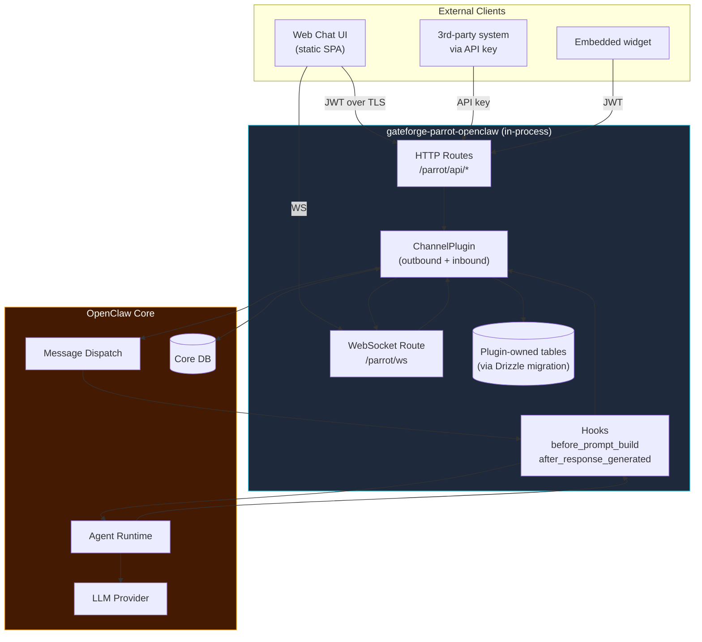
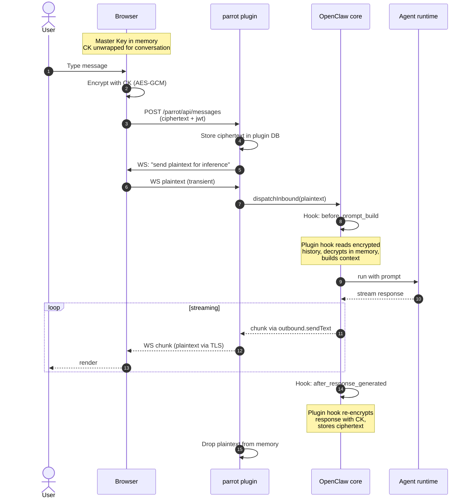
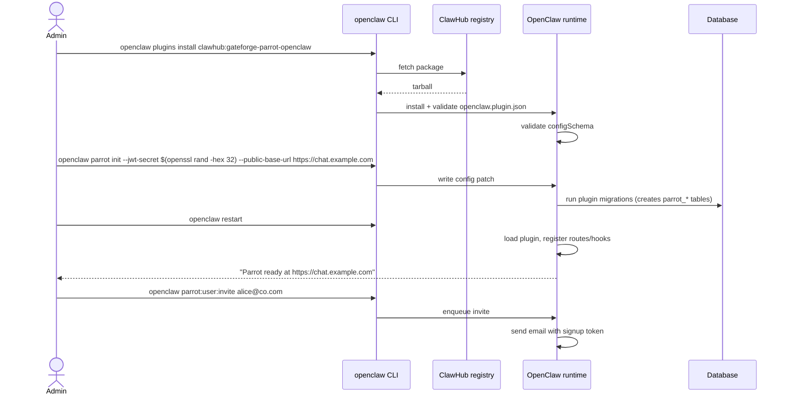

# OpenClaw Plugin Design — `gateforge-parrot-openclaw`

Repackage the BFF + E2EE chat platform as a **native OpenClaw channel plugin** instead of a standalone service. This document supersedes the standalone-service portions of `ARCHITECTURE.md`; the security model from `SECURITY.md` is unchanged.

---

## Why a Plugin (vs. Standalone Service)

| Concern | Standalone Service | Channel Plugin |
|---------|--------------------|----------------|
| OpenClaw token management | Plugin holds long-lived token | Not needed — plugin runs in-process |
| Agent dispatch | Manual proxy + streaming | Core dispatches to agent runtime automatically |
| Channel features (pairing, DM policy, threading) | Re-implement | Provided by `createChatChannelPlugin` |
| Prompt caching | Lost (every request looks new) | Works via `before_prompt_build` hook |
| Installation | Multi-service Docker compose | `openclaw plugins install clawhub:gateforge-parrot-openclaw` |
| Upgrades | Separate release cycle | Follows OpenClaw versioning |
| Distribution | Self-hosted only | Publishable to ClawHub plugin registry |

---

## Plugin Architecture



The plugin **runs inside the OpenClaw process**. It doesn't need a separate Postgres/Redis (it reuses OpenClaw's, or declares its own via `services`).

---

## How E2EE Fits Into the Plugin

Three integration points with the OpenClaw lifecycle:



**Critical privacy property:** The plugin code holds plaintext only during the request scope. Decrypted context is built in `before_prompt_build`, the agent processes it, the response is encrypted in `after_response_generated`, and nothing plaintext is persisted in the plugin DB.

---

## File Structure

```
gateforge-parrot-openclaw/
├── package.json
├── openclaw.plugin.json           # manifest (config schema, channel registration)
├── index.ts                        # defineChannelPluginEntry
├── setup-entry.ts                  # defineSetupPluginEntry
├── README.md
├── src/
│   ├── channel.ts                  # createChatChannelPlugin
│   ├── http/
│   │   ├── routes.ts               # REST API for the SPA
│   │   ├── ws.ts                   # WebSocket endpoint
│   │   └── auth.ts                 # JWT + API key middleware
│   ├── hooks/
│   │   ├── before-prompt-build.ts  # decrypt history → inject context
│   │   └── after-response.ts       # encrypt response → persist
│   ├── db/
│   │   ├── schema.ts               # Drizzle: conversations, messages, summaries, keys
│   │   └── migrations/             # auto-run on plugin activation
│   ├── crypto/
│   │   └── server.ts               # AES-GCM wrap/unwrap server side helpers
│   ├── services/
│   │   ├── auth.service.ts         # signup, login, JWT issuance
│   │   ├── conversation.service.ts # CRUD with ciphertext-only contract
│   │   └── audit.service.ts        # hash-chained audit log
│   └── frontend/                   # static SPA built and served by plugin
│       └── dist/                   # compiled output served at /parrot/ui
└── tests/
    ├── crypto.test.ts
    ├── hooks.test.ts
    └── e2e.test.ts
```

---

## `openclaw.plugin.json`

```json
{
  "id": "parrot",
  "name": "Parrot",
  "description": "Zero-knowledge end-to-end encrypted web chat channel with embeddable API and SDK",
  "version": "0.1.0",
  "channels": ["parrot"],
  "channelConfigs": {
    "parrot": {
      "supportsThreads": true,
      "supportsDMs": true
    }
  },
  "channelEnvVars": {
    "parrot": ["PARROT_JWT_SECRET", "PARROT_DB_URL"]
  },
  "activation": {
    "channels": ["parrot"],
    "routes": ["/parrot/*"]
  },
  "uiHints": {
    "jwtSecret": {
      "label": "JWT signing secret",
      "placeholder": "openssl rand -hex 32",
      "sensitive": true
    },
    "publicBaseUrl": {
      "label": "Public base URL",
      "placeholder": "https://chat.example.com"
    },
    "allowSignup": {
      "label": "Allow self-signup",
      "placeholder": "false"
    }
  },
  "configSchema": {
    "type": "object",
    "additionalProperties": false,
    "properties": {
      "jwtSecret": { "type": "string", "minLength": 32 },
      "publicBaseUrl": { "type": "string", "format": "uri" },
      "allowSignup": { "type": "boolean", "default": false },
      "idleLockMinutes": { "type": "integer", "default": 15, "minimum": 1 },
      "maxConversationsPerUser": { "type": "integer", "default": 1000 },
      "rateLimit": {
        "type": "object",
        "additionalProperties": false,
        "properties": {
          "windowSeconds": { "type": "integer", "default": 60 },
          "maxRequests": { "type": "integer", "default": 30 }
        }
      },
      "audit": {
        "type": "object",
        "additionalProperties": false,
        "properties": {
          "hashChain": { "type": "boolean", "default": true },
          "retainDays": { "type": "integer", "default": 365 }
        }
      }
    },
    "required": ["jwtSecret", "publicBaseUrl"]
  }
}
```

---

## `package.json`

```json
{
  "name": "@yourorg/gateforge-parrot-openclaw",
  "version": "0.1.0",
  "type": "module",
  "openclaw": {
    "extensions": ["./index.ts"],
    "setupEntry": "./setup-entry.ts",
    "channel": {
      "id": "parrot",
      "label": "Parrot",
      "blurb": "Zero-knowledge E2EE web chat channel"
    }
  },
  "dependencies": {
    "openclaw": "^X.Y",
    "drizzle-orm": "^0.30",
    "jose": "^5",
    "zod": "^3",
    "hash-wasm": "^4"
  }
}
```

---

## `index.ts` (Plugin Entry)

```ts
import { defineChannelPluginEntry } from "openclaw/plugin-sdk/channel-core";
import { parrotPlugin } from "./src/channel.js";
import { registerHttpRoutes } from "./src/http/routes.js";
import { registerWsRoute } from "./src/http/ws.js";
import { beforePromptBuild } from "./src/hooks/before-prompt-build.js";
import { afterResponseGenerated } from "./src/hooks/after-response.js";
import { runMigrations } from "./src/db/migrate.js";

export default defineChannelPluginEntry({
  id: "parrot",
  name: "Parrot",
  description: "Zero-knowledge E2EE chat channel",
  plugin: parrotPlugin,

  async registerFull(api) {
    // 1. Database migrations (plugin-owned tables)
    await runMigrations(api.db);

    // 2. HTTP routes for the SPA + API
    registerHttpRoutes(api);

    // 3. WebSocket route for streaming
    registerWsRoute(api);

    // 4. Lifecycle hooks
    api.registerHook("before_prompt_build", beforePromptBuild);
    api.registerHook("after_response_generated", afterResponseGenerated);

    // 5. Optional: register an agent tool that lets the agent
    //    list conversations or search by metadata (never content)
    api.registerTool({
      id: "parrot.listConversations",
      description: "List the user's conversations by metadata",
      handler: async ({ userId }) => {
        return api.db.query.conversations.findMany({
          where: (c, { eq }) => eq(c.userId, userId),
          columns: { id: true, createdAt: true, msgCount: true },
        });
      },
    });

    // 6. CLI extensions
    api.registerCli(({ program }) => {
      program
        .command("parrot:user:invite <email>")
        .description("Send a signup invite")
        .action(async (email) => {
          // ...
        });

      program
        .command("parrot:audit:verify")
        .description("Verify audit log hash chain integrity")
        .action(async () => {
          // ...
        });
    });
  },
});
```

---

## `src/channel.ts` (Channel Plugin)

```ts
import {
  createChatChannelPlugin,
  createChannelPluginBase,
} from "openclaw/plugin-sdk/channel-core";

export const parrotPlugin = createChatChannelPlugin({
  base: createChannelPluginBase({
    id: "parrot",
    setup: {
      resolveAccount: (cfg) => {
        const section = cfg.channels?.parrot;
        if (!section?.jwtSecret) throw new Error("jwtSecret required");
        return {
          jwtSecret: section.jwtSecret,
          baseUrl: section.publicBaseUrl,
        };
      },
      inspectAccount: (cfg) => ({
        enabled: Boolean(cfg.channels?.parrot?.jwtSecret),
        configured: Boolean(cfg.channels?.parrot?.jwtSecret),
      }),
    },
  }),

  // Parrot enforces auth at the HTTP layer, so DM policy is "always allow logged-in"
  security: {
    dm: {
      channelKey: "parrot",
      resolvePolicy: () => "allowlist",
      resolveAllowFrom: (account, ctx) => [ctx.userId],
      defaultPolicy: "allowlist",
    },
  },

  threading: { topLevelReplyToMode: "reply" },

  outbound: {
    attachedResults: {
      // Called by core to stream a chunk to the client
      sendText: async (params, ctx) => {
        const conn = ctx.runtime.getWsConnection(params.to);
        if (!conn) return { messageId: null };

        // params.to is the conversation id; client must be subscribed
        conn.send(JSON.stringify({
          type: "assistant.chunk",
          conversationId: params.to,
          // params.text is plaintext at this point — the after_response
          // hook will run separately to persist ciphertext
          text: params.text,
        }));
        return { messageId: crypto.randomUUID() };
      },
    },
  },
});
```

---

## Lifecycle Hooks

### `before_prompt_build`

```ts
// src/hooks/before-prompt-build.ts
import type { HookEntry } from "openclaw/plugin-sdk";
import { decryptInMemory } from "../crypto/server.js";

export const beforePromptBuild: HookEntry<"before_prompt_build"> = async (
  ctx,
  payload,
) => {
  // Only run for our channel
  if (payload.channel !== "parrot") return payload;

  const { conversationId, userId } = payload.metadata;

  // Load encrypted history + wrapped CK for this conversation
  const conv = await ctx.db.query.conversations.findFirst({
    where: (c, { eq }) => eq(c.id, conversationId),
  });
  if (!conv) return payload;

  // The CK is wrapped with the user's MK. The MK lives only in the
  // user's browser. For inference, the browser must have just sent
  // the unwrapped CK over WS in the active session — we read it
  // from request-scoped memory, NEVER from disk.
  const sessionCk = ctx.runtime.getSessionKey(userId, conversationId);
  if (!sessionCk) {
    throw new Error("Session key not available — client must establish session");
  }

  // Decrypt recent messages and summary in memory only
  const recentMsgs = await ctx.db.query.messages.findMany({
    where: (m, { eq }) => eq(m.conversationId, conversationId),
    orderBy: (m, { desc }) => [desc(m.createdAt)],
    limit: 20,
  });

  const summary = await ctx.db.query.summaries.findFirst({
    where: (s, { eq }) => eq(s.conversationId, conversationId),
    orderBy: (s, { desc }) => [desc(s.createdAt)],
  });

  const decryptedHistory = await Promise.all(
    recentMsgs.reverse().map(async (m) => ({
      role: m.role,
      content: await decryptInMemory(m.contentCiphertext, m.iv, sessionCk),
    })),
  );

  const decryptedSummary = summary
    ? await decryptInMemory(summary.summaryCiphertext, summary.iv, sessionCk)
    : null;

  // Inject into the prompt — core will combine with system prompt
  return {
    ...payload,
    messages: [
      ...(decryptedSummary
        ? [{ role: "system", content: `Summary so far: ${decryptedSummary}` }]
        : []),
      ...decryptedHistory,
      ...payload.messages,
    ],
  };
};
```

### `after_response_generated`

```ts
// src/hooks/after-response.ts
import type { HookEntry } from "openclaw/plugin-sdk";
import { encryptInMemory } from "../crypto/server.js";

export const afterResponseGenerated: HookEntry<"after_response_generated"> =
  async (ctx, payload) => {
    if (payload.channel !== "parrot") return payload;

    const { conversationId, userId } = payload.metadata;
    const sessionCk = ctx.runtime.getSessionKey(userId, conversationId);
    if (!sessionCk) return payload;

    // Encrypt user message + assistant response before persisting
    const userMsg = payload.userMessage;
    const assistantMsg = payload.responseText;

    const userEnc = await encryptInMemory(userMsg, sessionCk);
    const assistantEnc = await encryptInMemory(assistantMsg, sessionCk);

    await ctx.db.transaction(async (tx) => {
      await tx.insert(ctx.db.schema.messages).values([
        {
          conversationId,
          role: "user",
          contentCiphertext: userEnc.ciphertext,
          iv: userEnc.iv,
          tokensUsed: payload.usage.promptTokens,
        },
        {
          conversationId,
          role: "assistant",
          contentCiphertext: assistantEnc.ciphertext,
          iv: assistantEnc.iv,
          tokensUsed: payload.usage.completionTokens,
        },
      ]);

      await tx.insert(ctx.db.schema.auditLog).values({
        userId,
        action: "message.exchange",
        resourceType: "conversation",
        resourceId: conversationId,
        details: {
          model: payload.model,
          tokens: payload.usage,
        },
      });
    });

    // Trigger background summarization if needed
    const count = await ctx.db.query.messages.count({
      where: (m, { eq }) => eq(m.conversationId, conversationId),
    });
    if (count > 0 && count % 20 === 0) {
      ctx.runtime.enqueueJob("parrot.summarize", { conversationId });
    }

    return payload;
  };
```

---

## Database Schema (Drizzle, plugin-owned)

```ts
// src/db/schema.ts
import { pgTable, uuid, text, timestamp, integer, bytea, jsonb, boolean, pgEnum } from "drizzle-orm/pg-core";

export const roleEnum = pgEnum("parrot_role", ["user", "assistant", "system"]);

export const users = pgTable("parrot_users", {
  id: uuid("id").primaryKey().defaultRandom(),
  email: text("email").notNull().unique(),
  authHash: text("auth_hash").notNull(),
  authSalt: bytea("auth_salt").notNull(),
  masterSalt: bytea("master_salt").notNull(),
  createdAt: timestamp("created_at").defaultNow().notNull(),
});

export const conversations = pgTable("parrot_conversations", {
  id: uuid("id").primaryKey().defaultRandom(),
  userId: uuid("user_id").notNull().references(() => users.id),
  titleCiphertext: bytea("title_ciphertext"),
  titleIv: bytea("title_iv"),
  wrappedCk: bytea("wrapped_ck").notNull(),
  wrapIv: bytea("wrap_iv").notNull(),
  msgCount: integer("msg_count").default(0).notNull(),
  archived: boolean("archived").default(false).notNull(),
  createdAt: timestamp("created_at").defaultNow().notNull(),
});

export const messages = pgTable("parrot_messages", {
  id: uuid("id").primaryKey().defaultRandom(),
  conversationId: uuid("conversation_id").notNull().references(() => conversations.id),
  role: roleEnum("role").notNull(),
  contentCiphertext: bytea("content_ciphertext").notNull(),
  iv: bytea("iv").notNull(),
  contentLength: integer("content_length"),
  tokensUsed: integer("tokens_used"),
  metadata: jsonb("metadata"),
  createdAt: timestamp("created_at").defaultNow().notNull(),
});

export const summaries = pgTable("parrot_summaries", {
  id: uuid("id").primaryKey().defaultRandom(),
  conversationId: uuid("conversation_id").notNull().references(() => conversations.id),
  summaryCiphertext: bytea("summary_ciphertext").notNull(),
  iv: bytea("iv").notNull(),
  fromMsgId: uuid("from_msg_id"),
  toMsgId: uuid("to_msg_id"),
  createdAt: timestamp("created_at").defaultNow().notNull(),
});

export const auditLog = pgTable("parrot_audit_log", {
  id: uuid("id").primaryKey().defaultRandom(),
  userId: uuid("user_id"),
  action: text("action").notNull(),
  resourceType: text("resource_type"),
  resourceId: text("resource_id"),
  ipHash: text("ip_hash"),
  userAgent: text("user_agent"),
  result: text("result"),
  details: jsonb("details"),
  prevHash: text("prev_hash"),
  entryHash: text("entry_hash").notNull(),
  createdAt: timestamp("created_at").defaultNow().notNull(),
});

export const apiKeys = pgTable("parrot_api_keys", {
  id: uuid("id").primaryKey().defaultRandom(),
  userId: uuid("user_id").notNull().references(() => users.id),
  keyHash: text("key_hash").notNull().unique(),
  name: text("name").notNull(),
  scopes: jsonb("scopes").notNull(),
  lastUsedAt: timestamp("last_used_at"),
  revoked: boolean("revoked").default(false).notNull(),
  createdAt: timestamp("created_at").defaultNow().notNull(),
});
```

All tables are namespaced with `parrot_` to coexist with OpenClaw core tables.

---

## Installation Flow



---

## Update to Architecture Doc

### Things that change

| Previously in ARCHITECTURE.md | Now |
|---|---|
| Standalone BFF as Fastify service | Channel plugin runs in OpenClaw process |
| Holds OpenClaw token in vault | Not needed — in-process call |
| Separate Postgres for chat | Plugin-owned tables in OpenClaw's DB |
| Separate Redis for cache/rate limit | Use core's runtime services |
| Docker compose orchestrates everything | OpenClaw is the orchestrator |
| Phase 1 = MVP backend | Phase 1 = plugin skeleton + manifest + DB + auth |

### Things that DO NOT change

- E2EE design (browser-side keys, AES-256-GCM, AES-KW, Argon2id) — exactly the same
- User journeys (Maya / Daniel / Priya) — same flows, plugin is invisible to them
- Threat model — same; trust boundary is still the browser
- Security hardening (CSP, SRI, redaction, idle lock)

The plugin model **strengthens** security in one way: the OpenClaw token never has to be stored anywhere because the plugin doesn't need to talk to OpenClaw over the network — it IS OpenClaw.

---

## Hybrid Option (Best of Both)

You can also build it as a plugin **plus** publish the SPA as a separately deployable static bundle. Then:

- Self-hosters install the plugin → instant working chat at `https://their-host/parrot/ui`
- Or they deploy the SPA elsewhere (CDN, S3, pplx.app) and point it at the plugin's API

This is the most flexible deployment model.

---

## Revised Implementation Phases

| Phase | Scope |
|-------|-------|
| **Phase 1** | Plugin skeleton, manifest, DB migration, JWT auth, basic encrypted message store |
| **Phase 2** | Hook integration with core agent runtime; encrypted context build + response persist |
| **Phase 3** | SPA frontend built and served by plugin at `/parrot/ui` |
| **Phase 4** | API keys + REST API for 3rd-party systems |
| **Phase 5** | JS SDK + embeddable widget |
| **Phase 6** | Multi-tenant + audit log hash chain verification CLI |
| **Phase 7** | Publish to ClawHub registry |

---

## What I Need From You to Start Building

1. **Confirm direction** — channel plugin instead of standalone? (recommended)
2. **Self-host only, or publish to ClawHub** for others to install?
3. **Frontend bundled with plugin, or separate?** (recommended: bundled with optional external mode)
4. **Multi-tenant from day 1, or single-tenant first?** (recommended: single-tenant, multi-tenant in Phase 6)

Once you confirm, I'll:
- Scaffold the plugin repo with working manifest, DB migration, and JWT auth
- Wire up the two hooks with a minimal happy-path E2E test
- Provide a `make dev` workflow you can run on your Tailscale machine

---

*Plugin design for Parrot — native OpenClaw integration of the E2EE chat platform.*
