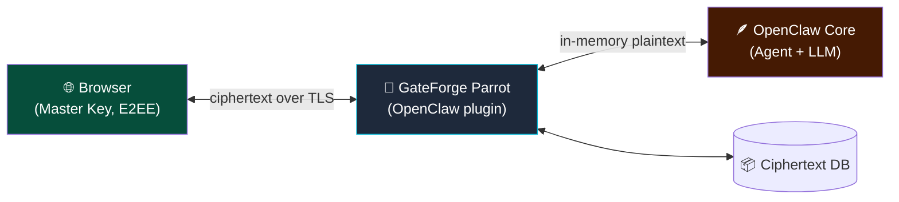

# 🦜 GateForge Parrot for OpenClaw

> Zero-knowledge, end-to-end encrypted chat channel for [OpenClaw](https://openclaw.ai) — a native plugin that turns your OpenClaw Gateway into an embeddable, secure web chat platform.

[](LICENSE)
[](#project-status)
[](https://openclaw.ai)

---

## What is Parrot?

**GateForge Parrot** is an OpenClaw channel plugin that lets you talk to your OpenClaw agent through a beautiful web UI, REST API, or embedded widget — without ever exposing your Gateway token to clients, and without anyone (including administrators) being able to read your messages.

Like a parrot, it faithfully relays your conversations — but only you hold the key to understanding them.

### Why "Parrot"?

- 🦜 **Conversation-native** — parrots are famous for talking
- 🗝️ **Mimics with fidelity** — message in, message out, nothing changed
- 🧠 **Remembers context** — multi-turn memory across sessions
- 🪶 **Lightweight** — runs in-process as a plugin, no extra services to babysit

---

## Key Features

| Feature | Description |
|---------|-------------|
| 🔒 **Zero-knowledge E2EE** | AES-256-GCM message encryption. Even DB admins cannot read content. |
| 🔑 **Browser-side key management** | Argon2id KDF. Master Key never leaves your device. |
| 🌐 **Embeddable web UI** | Pre-built React SPA served by the plugin at `/parrot/ui`. |
| 🔌 **REST API + JS SDK** | Plug into your CRM, ERP, or any 3rd-party system via scoped API keys. |
| 💬 **Multi-turn context** | Automatic conversation history + rolling summarization. |
| 🛡️ **Tamper-evident audit log** | Hash-chained log of every sensitive operation. |
| 🔄 **Native OpenClaw integration** | Uses `before_prompt_build` + `after_response_generated` hooks. |
| 🏗️ **Multi-tenant ready** | Each tenant has independent keys and isolation. |
| 📡 **WebSocket streaming** | First-token latency under 200ms. |

---

## Quick Start

> ⚠️ **Status: Design phase.** This repo currently contains architecture, security, and user-journey specs plus a working crypto PoC. Implementation begins after design sign-off.

Once released, installation will be:

```bash
# Install the plugin from ClawHub
openclaw plugins install clawhub:gateforge-parrot-openclaw

# Initialize with a JWT secret and your public URL
openclaw parrot init \
  --jwt-secret "$(openssl rand -hex 32)" \
  --public-base-url "https://chat.example.com"

# Restart OpenClaw to load the plugin
openclaw restart

# Invite your first user
openclaw parrot:user:invite alice@example.com
```

Then open `https://chat.example.com/parrot/ui` and sign in.

---

## How It Works

```
┌─────────────┐  encrypted   ┌────────────────────────┐  in-memory   ┌──────────┐
│  Browser    │ ───────────▶ │  Parrot (plugin in     │ ───────────▶ │ OpenClaw │
│  Master Key │              │  OpenClaw process)     │              │  Agent   │
│  (E2EE)     │ ◀─────────── │  ciphertext-only DB    │ ◀─────────── │          │
└─────────────┘   encrypted  └────────────────────────┘   response   └──────────┘
```

- 🔑 Your browser derives a **Master Key** from your password (Argon2id) — server never sees it
- 🗝️ Each conversation has its own **Conversation Key**, wrapped with the Master Key
- 📦 Messages are AES-256-GCM encrypted **before** leaving the browser
- 🪶 Parrot stores only ciphertext; plaintext exists in server memory only during one inference request
- 🧠 The OpenClaw agent decrypts in-memory, processes, response is re-encrypted before persisting

Read [SECURITY.md](./SECURITY.md) for the full cryptographic design.

---

## Documentation

| Document | What's in it |
|----------|--------------|
| [ARCHITECTURE.md](./ARCHITECTURE.md) | System architecture, workflow + state + sequence + DFD + ER diagrams, tech stack |
| [SECURITY.md](./SECURITY.md) | E2EE design, key hierarchy, threat model, compliance mapping |
| [USER_JOURNEYS.md](./USER_JOURNEYS.md) | User / admin / auditor personas and end-to-end flows |
| [PLUGIN_DESIGN.md](./PLUGIN_DESIGN.md) | OpenClaw channel plugin design — manifest, hooks, schema |
| [poc/](./poc/) | Working TypeScript crypto module demonstrating the E2EE primitives |

All diagrams use **Mermaid** — they render natively on GitHub.

---

## Architecture at a Glance



---

## Tech Stack

- **Plugin runtime**: TypeScript + `openclaw/plugin-sdk`
- **Database**: PostgreSQL (via OpenClaw core) with Drizzle ORM
- **Frontend**: React 18 + Vite + Tailwind + shadcn/ui
- **Crypto**: Web Crypto API (AES-256-GCM, AES-KW) + Argon2id via `hash-wasm`
- **Auth**: JWT (jose) + scoped API keys
- **Transport**: HTTP + WebSocket via plugin-registered routes

---

## Roadmap

| Phase | Status | Scope |
|-------|--------|-------|
| **0** | ✅ Done | Architecture & security design, crypto PoC |
| **1** | ✅ Done | Plugin skeleton, manifest, DB migration, JWT auth, bundled React UI |
| **2** | 🚧 Next | `llm_input` + `llm_output` hooks wired to agent streaming |
| **3** | ⏳ | Polished UI: streaming responses, model picker, settings |
| **4** | ⏳ | REST API + API keys for 3rd-party integration |
| **5** | ⏳ | JS SDK + embeddable widget |
| **6** | ⏳ | Audit log verification CLI, password recovery via shards |
| **7** | ⏳ | Publish to ClawHub registry |

See [PLUGIN_DESIGN.md](./PLUGIN_DESIGN.md#revised-implementation-phases) for full phase breakdown.

---

## Project Status

🚀 **Phase 1 MVP shipped** — install instructions in [`INSTALL.md`](./INSTALL.md).

The `packages/plugin` workspace builds and publishes the plugin. The `packages/ui` workspace builds the React UI, which is bundled into `packages/plugin/ui-dist/` and served at `/parrot/ui` when the plugin loads.

```bash
# Build everything
npm install
npm run build:all
```

If you have feedback or hit issues, please [open an issue](https://github.com/tonylnng/gateforge-parrot-openclaw/issues).

---

## Contributing

Not yet open for code contributions — design feedback is welcome via Issues.

Once Phase 1 begins, contribution guidelines will be added.

---

## License

[MIT](./LICENSE) — see LICENSE file for details.

---

## About GateForge

GateForge Parrot is part of the **GateForge** product family — secure, self-hostable solutions for modern infrastructure.

Built with 🦜 in Hong Kong.
