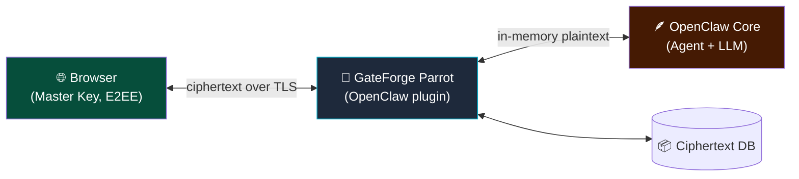
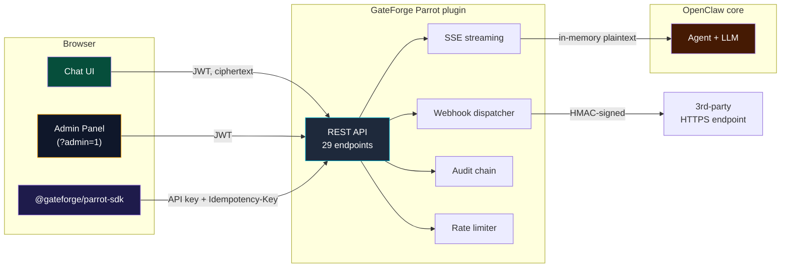

# 🦜 GateForge Parrot for OpenClaw

> Zero-knowledge, end-to-end encrypted chat channel for [OpenClaw](https://openclaw.ai) — a native plugin that turns your OpenClaw Gateway into an embeddable, secure web chat platform.

[](LICENSE)
[](#project-status)
[](https://openclaw.ai)
[](./openapi.yaml)
[](./packages/sdk)

---

## What is Parrot?

**GateForge Parrot** is an OpenClaw channel plugin that lets you talk to your OpenClaw agent through a beautiful web UI, REST API, or embedded widget — without ever exposing your Gateway token to clients, and without anyone (including administrators) being able to read your messages.

Like a parrot, it faithfully relays your conversations — but only you hold the key to understanding them.

### Why "Parrot"?

- 🦜 **Conversation-native** — parrots are famous for talking
- 🗝️ **Mimics with fidelity** — message in, message out, nothing changed
- 🧠 **Remembers context** — multi-turn memory across sessions
- 🪶 **Lightweight** — runs in-process as a plugin, no extra services to babysit

---

## Key Features

| Feature | Description |
|---------|-------------|
| 🔒 **Zero-knowledge E2EE** | AES-256-GCM message encryption. Even DB admins cannot read content. |
| 🔑 **Browser-side key management** | Argon2id KDF. Master Key never leaves your device. |
| 🌐 **Embeddable web UI** | Pre-built React SPA served by the plugin at `/gateforge-parrot/ui`. |
| 🛠️ **Admin panel** | Built-in `?admin=1` view: manage API keys, webhooks, and verify the audit chain. |
| 🔌 **REST API + JS SDK** | 29 endpoints + `@gateforge/parrot-sdk` — embed Parrot in any 3rd-party app via scoped API keys. |
| 📡 **SSE assistant streaming** | Token-by-token responses through `POST /messages/stream` (re-encrypted on the fly). |
| 💬 **Session management** | List / create / rename / pin / archive / delete / search / export — all titles client-encrypted. |
| 🪝 **Outbound webhooks** | HMAC-signed event delivery with retries, delivery log, and one-click ping from the admin panel. |
| 🛡️ **Tamper-evident audit log** | Hash-chained log with built-in `/audit/verify` chain checker. |
| 🚦 **Rate limiting & idempotency** | Per-key + per-tenant token buckets, `Idempotency-Key` support, standard `X-RateLimit-*` headers. |
| 🔄 **Native OpenClaw integration** | Uses `llm_input` + `llm_output` plugin hooks. |
| 🏗️ **Multi-tenant ready** | Each tenant has independent keys and isolation. |

---

## Quick Start

> ✅ **Status: Phases 1 – 3 shipped.** Plugin + bundled React UI + Integration API (29 endpoints, OpenAPI 3.1, SDK, webhooks, SSE streaming, admin panel, audit chain verifier) all in `main`.

```bash
# 1. Clone and build
git clone https://github.com/tonylnng/gateforge-parrot-openclaw.git
cd gateforge-parrot-openclaw
npm install && npm run build:all

# 2. Install into your OpenClaw
openclaw plugins install ./packages/plugin

# 3. Generate a JWT secret
openssl rand -base64 48

# 4. Add a plugins.entries.gateforge-parrot block to ~/.openclaw/openclaw.json
#    (publicBaseUrl = your OpenClaw gateway URL, jwtSecret from step 3)

# 5. Restart and open the UI
openclaw gateway restart
# → open <publicBaseUrl>/gateforge-parrot/ui
```

Full walkthrough with config examples and Tailscale/LAN/public-domain variants is in [`INSTALL.md`](./INSTALL.md).

---

## How It Works

```
┌─────────────┐  encrypted   ┌────────────────────────┐  in-memory   ┌──────────┐
│  Browser    │ ───────────▶ │  Parrot (plugin in     │ ───────────▶ │ OpenClaw │
│  Master Key │              │  OpenClaw process)     │              │  Agent   │
│  (E2EE)     │ ◀─────────── │  ciphertext-only DB    │ ◀─────────── │          │
└─────────────┘   encrypted  └────────────────────────┘   response   └──────────┘
```

- 🔑 Your browser derives a **Master Key** from your password (Argon2id) — server never sees it
- 🗝️ Each conversation has its own **Conversation Key**, wrapped with the Master Key
- 📦 Messages are AES-256-GCM encrypted **before** leaving the browser
- 🪶 Parrot stores only ciphertext; plaintext exists in server memory only during one inference request
- 🧠 The OpenClaw agent decrypts in-memory, processes, response is re-encrypted before persisting

Read [SECURITY.md](./SECURITY.md) for the full cryptographic design.

---

## Documentation

| Document | What's in it |
|----------|--------------|
| [ARCHITECTURE.md](./ARCHITECTURE.md) | System architecture, workflow + state + sequence + DFD + ER diagrams, tech stack |
| [SECURITY.md](./SECURITY.md) | E2EE design, key hierarchy, threat model, compliance mapping |
| [USER_JOURNEYS.md](./USER_JOURNEYS.md) | User / admin / auditor personas and end-to-end flows |
| [PLUGIN_DESIGN.md](./PLUGIN_DESIGN.md) | OpenClaw channel plugin design — manifest, hooks, schema |
| [INTEGRATION_API.md](./INTEGRATION_API.md) | Phase 2 design — sessions, scoped API keys, JS SDK, webhooks, rate limiting (7 Mermaid diagrams) |
| [WIRE_FORMAT.md](./WIRE_FORMAT.md) | Wire-format reference for non-JS clients — headers, framing, error envelope, SSE protocol |
| [openapi.yaml](./openapi.yaml) | OpenAPI 3.1 spec — 29 operations, drift-checked in CI |
| [CHANGELOG.md](./CHANGELOG.md) | Versioned change history |
| [poc/](./poc/) | Working TypeScript crypto module demonstrating the E2EE primitives |

All diagrams use **Mermaid** — they render natively on GitHub.

---

## Architecture at a Glance



---

## Tech Stack

- **Plugin runtime**: TypeScript + `openclaw/plugin-sdk`
- **Database**: PostgreSQL (via OpenClaw core) with Drizzle ORM
- **Frontend**: React 18 + Vite + Tailwind + shadcn/ui
- **Crypto**: Web Crypto API (AES-256-GCM, AES-KW) + Argon2id via `hash-wasm`
- **Auth**: JWT (jose) + scoped API keys
- **Transport**: HTTP + WebSocket via plugin-registered routes

---

## Roadmap

| Phase | Status | Scope |
|-------|--------|-------|
| **0** | ✅ Done | Architecture & security design, crypto PoC |
| **1** | ✅ Done | Plugin skeleton, manifest, DB migration, JWT auth, bundled React UI |
| **2** | ✅ Done | Integration API — sessions, scoped API keys, webhooks, SSE streaming, rate limiting, idempotency, OpenAPI 3.1, SDK |
| **3** | ✅ Done | Admin panel UI (API keys / Webhooks / Audit), assistant SSE streaming in the bundled UI |
| **4** | ⏳ Next | Embeddable widget (`<script>` drop-in) + iframe host SDK |
| **5** | ⏳ | Audit log verification CLI + password recovery via Shamir shards |
| **6** | ⏳ | Publish to ClawHub registry + npm release of `@gateforge/parrot-sdk` |

See [PLUGIN_DESIGN.md](./PLUGIN_DESIGN.md#revised-implementation-phases) for full phase breakdown.

---

## Project Status

🚀 **Phases 1 – 3 shipped** — production-ready integration surface in `main`. Install instructions in [`INSTALL.md`](./INSTALL.md).

The monorepo ships three workspaces:

- `@gateforge/parrot-openclaw` (`packages/plugin`) — the OpenClaw channel plugin, builds to `dist/` and bundles the UI into `ui-dist/`.
- `@gateforge/parrot-ui` (`packages/ui`) — React 18 + Vite frontend, served at `/gateforge-parrot/ui` with `?admin=1` for the admin panel.
- `@gateforge/parrot-sdk` (`packages/sdk`) — typed REST + WebCrypto SDK for 3rd-party integrators.

### Shipped surface



### Build everything

```bash
npm install
npm run build:all       # ui (vite) + plugin (tsc) + sdk (tsc)
npm run check:openapi   # drift check — spec must match router
```

If you have feedback or hit issues, please [open an issue](https://github.com/tonylnng/gateforge-parrot-openclaw/issues).

---

## Contributing

Not yet open for code contributions — design feedback is welcome via Issues.

Once Phase 1 begins, contribution guidelines will be added.

---

## License

[MIT](./LICENSE) — see LICENSE file for details.

---

## About GateForge

GateForge Parrot is part of the **GateForge** product family — secure, self-hostable solutions for modern infrastructure.

Built with 🦜 in Hong Kong.
