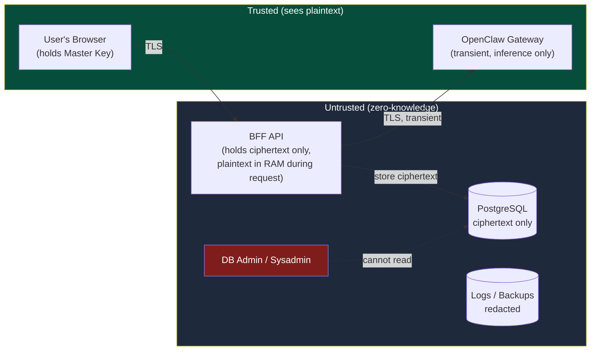
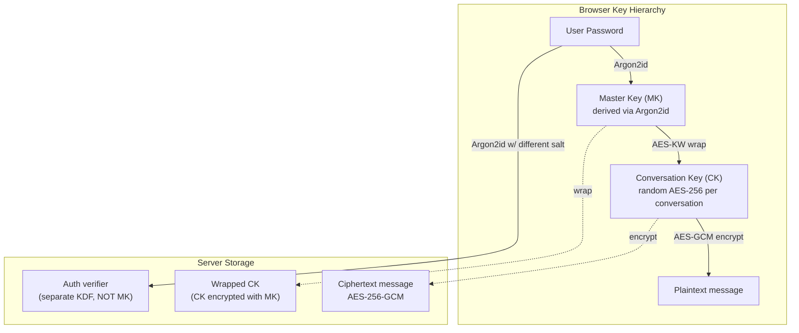
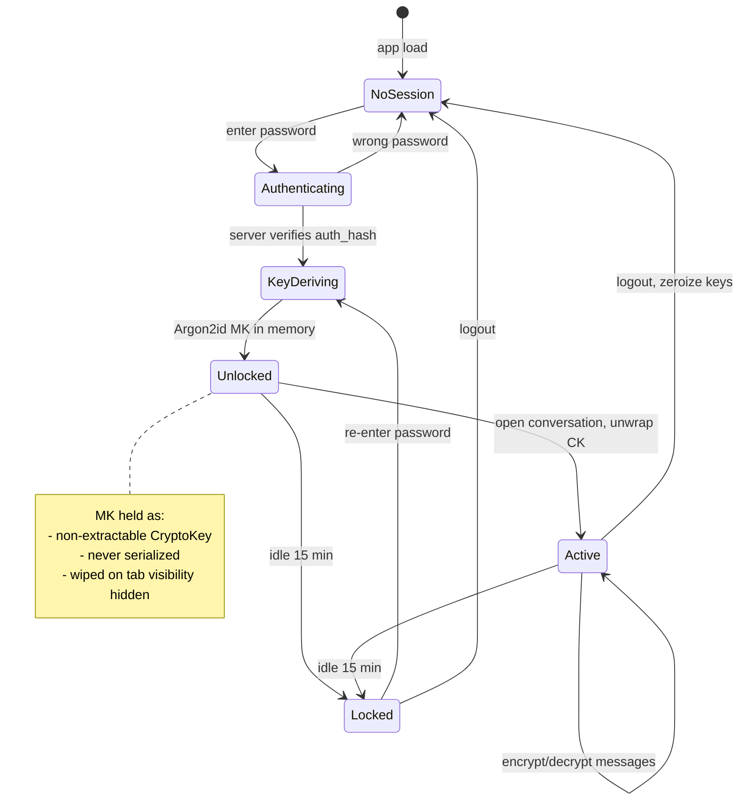
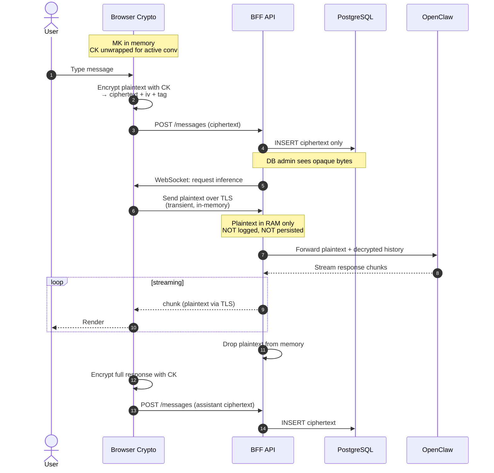
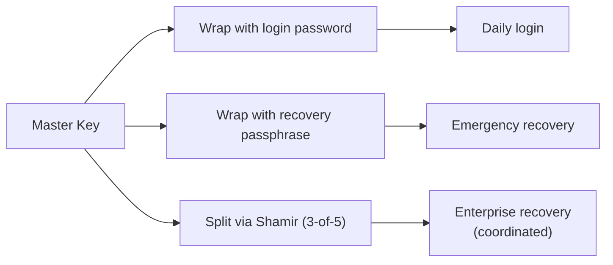

# GateForge Parrot — Security & Encryption

End-to-end encryption design where **even DB admins and BFF operators cannot read message content**. This document complements `ARCHITECTURE.md`.

---

## Trust Model

**Trust boundary** = user's browser. Anything outside the browser sees only ciphertext (except OpenClaw, which sees plaintext **only during inference**, never persisted).

---

## Encryption Model (Hybrid E2EE)

---

## Cryptographic Primitives

| Purpose | Algorithm | Parameters | Library |
|---------|-----------|------------|---------|
| Key derivation from password | **Argon2id** | m=64MB, t=3, p=4, 16B salt | `hash-wasm` |
| Symmetric encryption | **AES-256-GCM** | 96-bit nonce, 128-bit tag | Web Crypto |
| Key wrapping | **AES-256-KW** | RFC 3394 | Web Crypto |
| Asymmetric (sharing) | **X25519** + **XChaCha20-Poly1305** | — | `libsodium.js` |
| Blind index (optional) | **HMAC-SHA256** | per-tenant key | Web Crypto |
| Random | `crypto.getRandomValues` | CSPRNG | Web Crypto |

All primitives are implemented in **native Web Crypto API** wherever possible — audited, hardware-accelerated, non-extractable keys.

---

## Key Lifecycle

---

## Message Send Flow (with E2EE)

---

## Server Storage — What's Encrypted

| Field | Stored As | Visible to Admin? |
|-------|-----------|-------------------|
| Message content | AES-256-GCM ciphertext | No |
| Conversation title | AES-256-GCM ciphertext | No |
| Summary text | AES-256-GCM ciphertext | No |
| Conversation Key | Wrapped with Master Key | No |
| Password | Argon2id verifier (separate KDF) | No |
| Message role (user/assistant) | Plaintext | Yes (metadata) |
| Message length (approx) | Plaintext int | Yes (metadata) |
| Timestamps | Plaintext | Yes (metadata) |
| User email | Plaintext (for login) | Yes |

**Metadata leakage is acceptable** — count, timing, length patterns are visible. If you need to hide these too, add padding and dummy traffic (rarely needed).

---

## Key Recovery Options

Lost password = lost history by default. Three optional mitigations:

| Method | UX | Security |
|--------|-----|----------|
| **Recovery passphrase** | User stores a second long passphrase offline | Same as password; user responsibility |
| **Shamir's Secret Sharing** | MK split into N shares, M required to recover | Enterprise; requires coordinated recovery |
| **Device-bound keys** | Each device has key pair; sync via key exchange | Best UX; loses history if all devices lost |

---

## Threat Model

| Threat | Mitigated? | Notes |
|--------|-----------|-------|
| Malicious DB admin reads messages | ✅ | Ciphertext only |
| Stolen backup tape | ✅ | All sensitive fields encrypted |
| Logs containing plaintext | ✅ | Pino redaction middleware; structured logging |
| BFF RAM compromise (active session) | ⚠️ Partial | Only in-flight messages exposed; historical ciphertext safe |
| Compromised OpenClaw | ⚠️ Partial | Only current request plaintext |
| Lost password | ❌ By design | History unrecoverable without recovery option |
| XSS on frontend | ❌ | E2EE cannot defend trusted-code execution — strict CSP required |
| Malicious dependency / supply chain | ❌ | Audit + SRI on CDN scripts |
| Compromised user device | ❌ | Endpoint security required |
| Quantum computer (future) | ⚠️ | AES-256 quantum-resistant; X25519 not — plan migration to ML-KEM |

---

## Hardening Requirements (Frontend)

E2EE only works if the browser environment is trustworthy. Mandatory:

- **Strict CSP**: no `unsafe-inline`, no `unsafe-eval`, no third-party script execution
- **SRI**: integrity hashes on every external script (Mermaid, marked, etc.)
- **HSTS** with `preload` and 1-year max-age
- **Secure, HttpOnly, SameSite=Strict** cookies
- **Subresource trust audit**: lock all npm dependency versions, automated scan (Snyk / npm audit)
- **No inline event handlers**, use `addEventListener`
- **Disable browser extensions in iframe embed** (`sandbox` attribute)
- **Idle lock**: wipe MK after 15 min idle or tab hidden
- **Key zeroization**: explicit `key = null` + GC hint on logout

---

## Hardening Requirements (Backend)

- **Pino redaction**: redact any field named `content`, `plaintext`, `message`, `password`, `token` from logs
- **No plaintext on disk**: enforce via lint rule + code review
- **Minimal request lifetime**: plaintext exists only during one request handler scope
- **Memory zeroization**: use `Buffer.fill(0)` on sensitive buffers before release
- **TLS 1.3 only**, OCSP stapling, modern cipher suites
- **Rate limiting per user**: prevents bulk decryption oracle attacks
- **Audit log**: every key wrap/unwrap operation logged (metadata only)

---

## Search & Analytics — What's Possible

| Feature | E2EE-compatible? | How |
|---------|------------------|-----|
| Full-text search | ❌ on server | Client-side after decrypt; use IndexedDB |
| Exact match search | ⚠️ Via blind index | HMAC-SHA256 with tenant key; leaks frequency |
| Date range filter | ✅ | Timestamp is plaintext |
| Conversation count | ✅ | Metadata |
| Token usage analytics | ✅ | Counts plaintext |
| Message sentiment analysis | ❌ on server | Requires plaintext; client-side only |
| Admin moderation | ❌ | By design — admin cannot read content |

For moderation/compliance, consider **escrow keys** (separate wrap of MK under a compliance officer's public key, used only with court order + audit trail). This is a policy decision, not technical.

---

## Compliance Notes

- **GDPR Article 32** — strong pseudonymization & encryption at rest: ✅
- **GDPR right to erasure** — delete ciphertext + wrapped CK: ✅
- **HIPAA** — encryption + audit trail + access controls: ✅ (with audit log)
- **PCI-DSS** — no card data should ever be in chat; out of scope by design
- **SOC 2** — encryption controls, key management, audit log: ✅

---

## Implementation Phases (Security)

| Phase | Scope |
|-------|-------|
| **2.5 — E2EE Core** | Web Crypto wrapper, KDF on login, per-conversation keys, encrypt at message level |
| **2.6 — Recovery** | Recovery passphrase, optional Shamir, key rotation |
| **2.7 — Hardening** | CSP, SRI, redaction middleware, key zeroization, idle lock |
| **2.8 — Audit** | Independent crypto review before production |

---

*Security document for the GateForge Parrot — zero-knowledge E2EE for stored messages.*
