# GateForge Parrot — User Journeys

User journey maps for the three primary personas. Each journey shows screens, actions, system responses, security boundaries, and pain points.

---

## Personas

| Persona | Role | Primary Goals | Key Concerns |
|---------|------|---------------|--------------|
| **Maya** — End User | Knowledge worker using chat for daily tasks | Fast, reliable, private conversations | Privacy, message loss, search |
| **Daniel** — Admin | Platform operator managing tenants, users, integrations | Operability, tenant onboarding, capacity, integration setup | Cannot read content (by design); needs strong metadata + audit |
| **Priya** — Auditor / Compliance Officer | Internal/external auditor verifying security & compliance | Evidence of controls, audit trails, incident review | Tamper-proof logs, scope of access, regulatory mapping |

---

## Persona 1 — Normal User (Maya)

### Journey Map: First-Time Setup → Daily Use

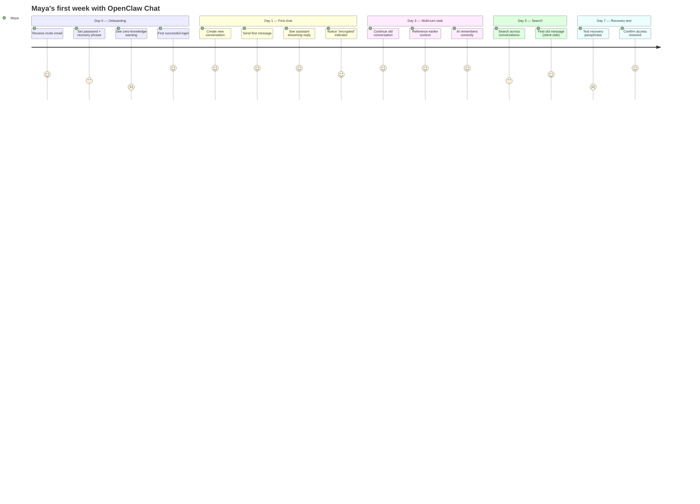

### 1.1 Onboarding Flow

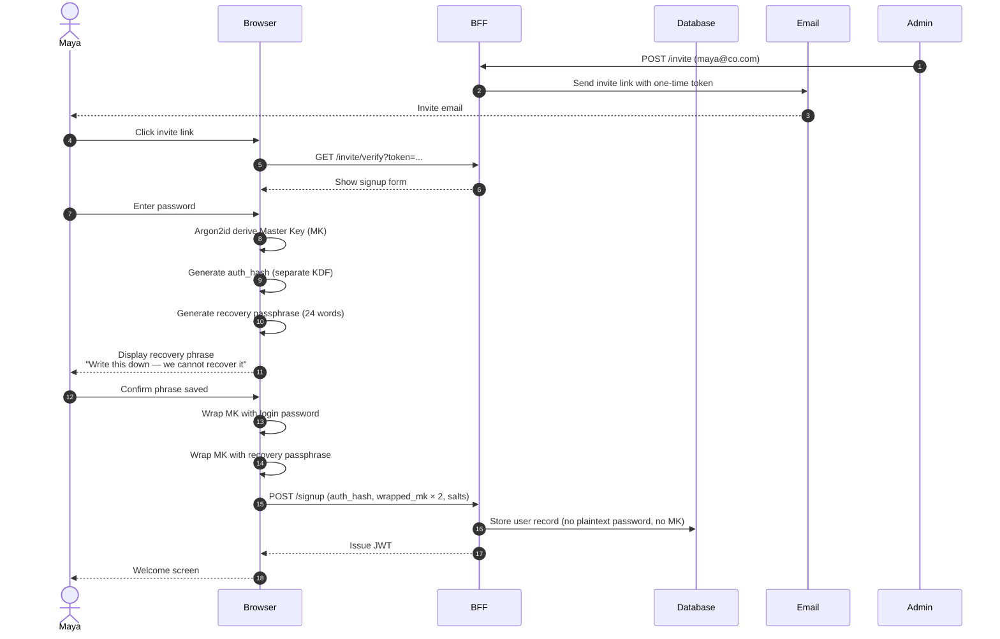

### 1.2 Daily Login

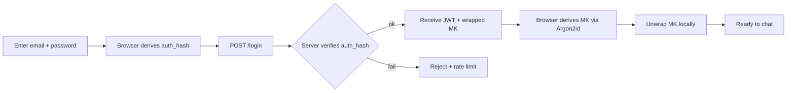

### 1.3 Sending a Message

**Happy path:**

1. Maya opens "Q3 planning" conversation
2. Browser unwraps Conversation Key (CK) with MK
3. Maya types "Summarize last week's notes"
4. Browser encrypts with CK → ciphertext + IV + tag
5. POST `/api/messages` — server stores ciphertext
6. Server requests plaintext over WebSocket (transient)
7. Browser sends plaintext + decrypted recent history
8. Server forwards to OpenClaw, streams response chunks
9. Browser displays streamed tokens
10. On completion, browser encrypts full assistant reply, POSTs ciphertext

**Visible to Maya:**
- Green "🔒 Encrypted" indicator in conversation header
- Streaming response (< 200ms first token)
- Connection status dot (green when WS healthy)

**Invisible but happening:**
- Plaintext lives in server RAM ~ duration of request
- DB receives ciphertext only
- Audit log records: "user X sent message in conv Y at T" (no content)

### 1.4 Edge Cases

| Scenario | UX | Technical |
|----------|-----|----------|
| **Lost password** | "Use recovery phrase" link → enter 24 words → set new password | Browser unwraps MK with recovery KDF, re-wraps with new password |
| **Network drops mid-stream** | "Reconnecting..." badge, response resumes or shows error | WS auto-reconnect with exp backoff; assistant message stored only if complete |
| **Idle 15 min** | App locks, shows "Re-enter password" overlay | MK wiped from memory; need password to derive again |
| **Multiple devices** | Each device requires login + MK derivation | Same MK derived independently from same password |
| **Tab closed mid-message** | Draft lost (intentional — never persisted unencrypted) | No localStorage; only React state |
| **Long conversation (> 50 msgs)** | Older messages hidden behind "Show more"; AI still remembers via summary | Server returns wrapped summary; browser decrypts and prepends to context |

### 1.5 Sharing a Conversation (Optional Feature)

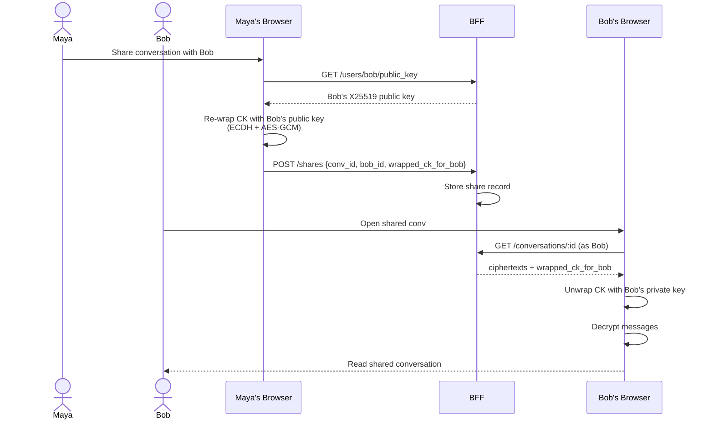

---

## Persona 2 — Admin (Daniel)

Daniel manages the platform: tenant onboarding, user provisioning, OpenClaw configuration, monitoring, billing. **He cannot read message content** — that's enforced by cryptography, not policy.

### Journey Map

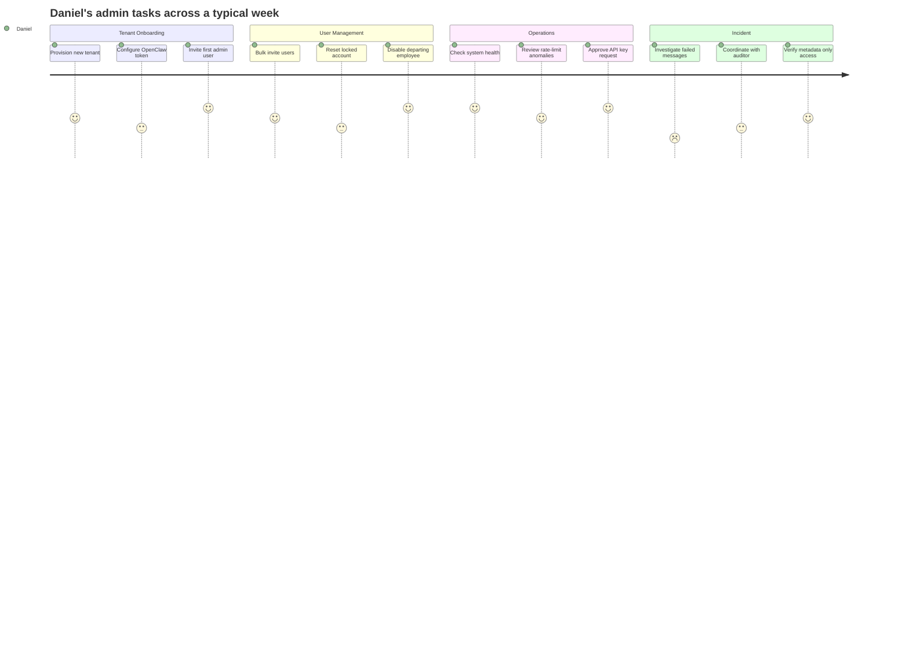

### 2.1 Admin Dashboard — What Daniel Sees

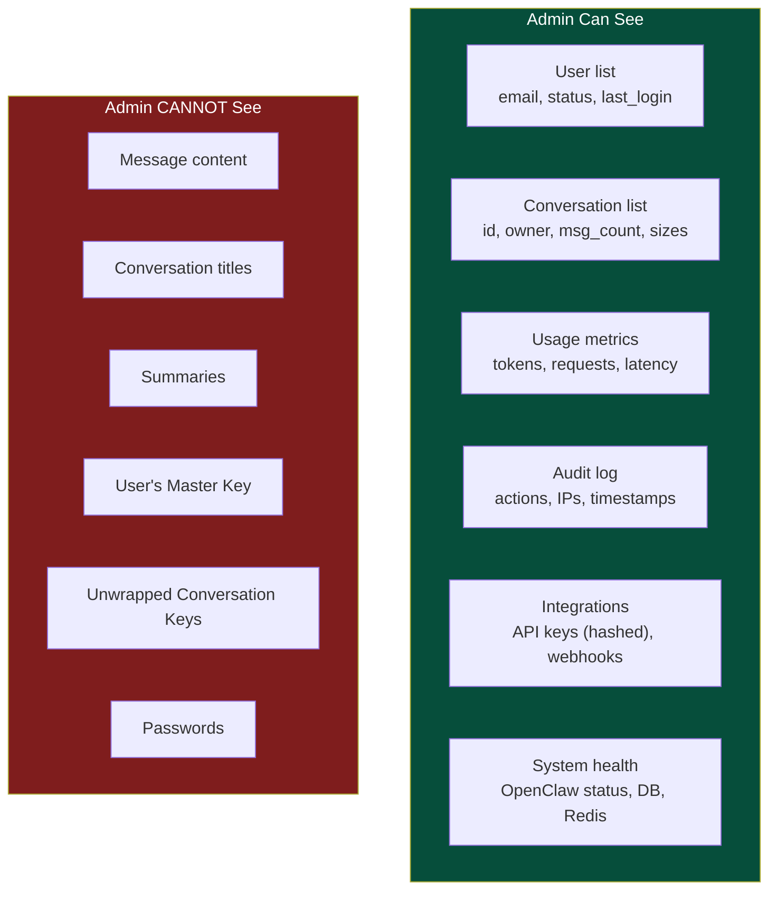

### 2.2 Tenant Onboarding Flow

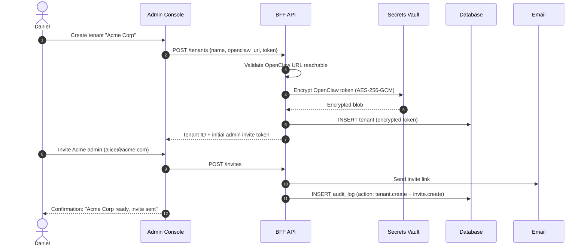

### 2.3 User Management

| Task | UI | What Happens | Audit Entry |
|------|-----|-------------|-------------|
| **Invite user** | Enter email, role | Server generates one-time signup token | `user.invite_sent` |
| **Reset password** | Click "Send reset link" | User receives email; their MK re-derived from new password — **server does NOT regain access to old content** | `user.password_reset_requested` |
| **Disable user** | Toggle "Active" | JWT issuance blocked; existing tokens revoked via Redis blacklist | `user.disabled` |
| **Delete user** | "Delete account" with confirmation | Wipes ciphertext + wrapped keys; **history cryptographically destroyed** | `user.deleted` |
| **Transfer ownership** | Select new owner | Requires user to re-share keys to new owner (cryptographic operation, server cannot do unilaterally) | `conv.share_initiated` |

**Important UX note:** When Daniel "resets" a user's password, the user **loses access to their history** unless they have a recovery passphrase. This must be made painfully clear in the admin UI:

```
⚠️  Resetting Maya's password will lock her out of all existing 
    conversation history. She must use her recovery passphrase 
    to regain access. The platform CANNOT recover encrypted data 
    on her behalf.
    
    [ Cancel ]  [ Send reset link anyway ]
```

### 2.4 Integration Management

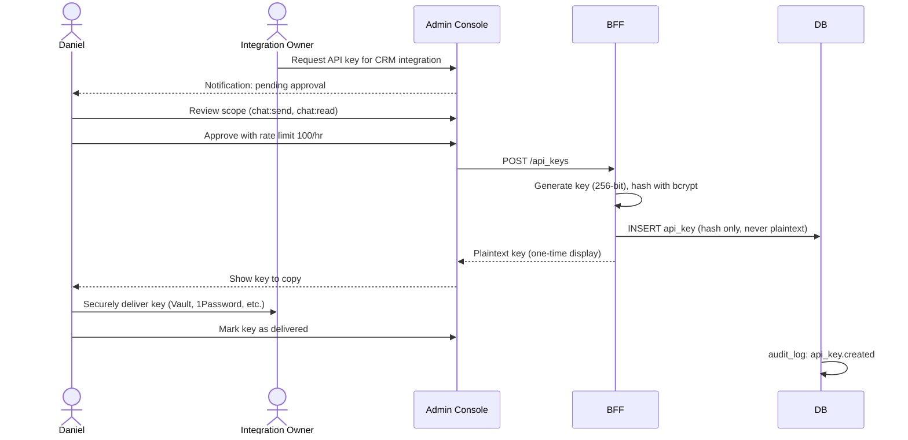

### 2.5 Operational Monitoring

Daniel has dashboards showing:

- **Throughput** — requests/sec, p50/p95/p99 latency
- **Error rates** — by endpoint, by tenant
- **OpenClaw health** — circuit breaker status, queue depth
- **Storage** — ciphertext volume per tenant, growth rate
- **Rate-limit anomalies** — users hitting limits (signal of abuse or runaway clients)
- **Audit log volume** — sudden spikes = investigation needed

He **cannot** see:
- What users are talking about
- Message keywords or themes
- Sentiment, length distributions of content

### 2.6 Incident Response (Admin Side)

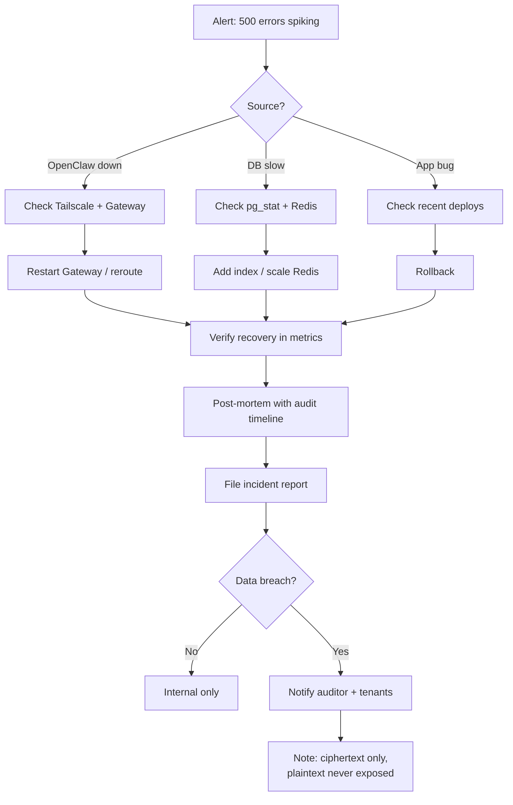

---

## Persona 3 — Auditor / Compliance Officer (Priya)

Priya does scheduled compliance reviews and incident investigations. She needs **evidence of controls** — not the ability to break them.

### Journey Map

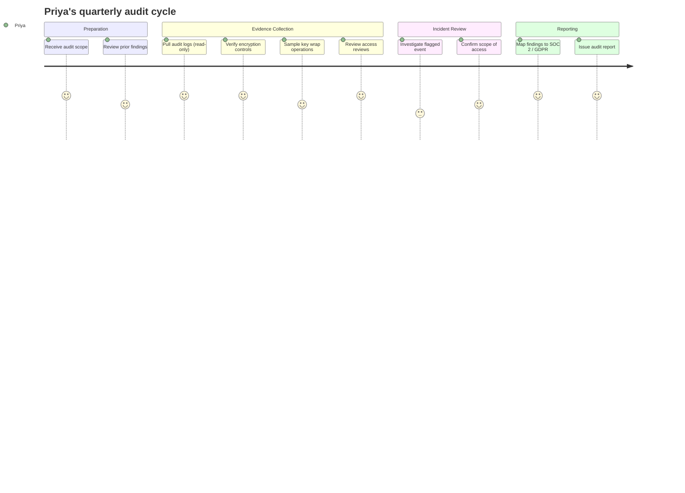

### 3.1 Audit Role & Access Model

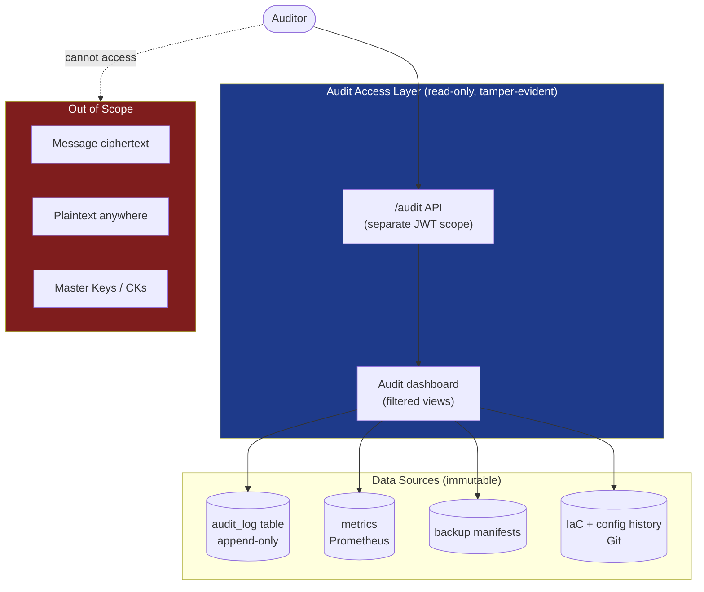

### 3.2 What's in the Audit Log

Every entry is **append-only** (PostgreSQL with `INSERT`-only role) and **hash-chained** (each entry includes hash of previous, like a Merkle log) to prove non-tampering.

| Field | Example |
|-------|---------|
| `id` | UUID |
| `timestamp` | 2026-05-16T10:23:45Z |
| `actor_id` | user UUID or "system" |
| `actor_type` | user / admin / api_key / system |
| `action` | `user.login`, `conv.create`, `key.unwrap`, `api_key.created`, `admin.tenant_create` |
| `resource_type` | user / conversation / message / api_key / tenant |
| `resource_id` | UUID (no content) |
| `ip_address` | hashed if regulatory requires |
| `user_agent` | string |
| `result` | success / failure / partial |
| `details` | jsonb metadata (no plaintext) |
| `prev_hash` | sha256(previous entry) |
| `entry_hash` | sha256(this entry) |

### 3.3 Quarterly Compliance Review Flow

```mermaid
sequenceDiagram
    autonumber
    actor Priya
    participant Audit as Audit Console
    participant API as BFF API
    participant Log as audit_log

    Priya->>Audit: Log in with auditor role
    Audit->>API: Verify scope: audit:read
    API-->>Audit: JWT with audit-only claims

    Priya->>Audit: Export Q1 audit log (CSV)
    Audit->>API: GET /audit?from=2026-01-01&to=2026-03-31
    API->>Log: SELECT with pagination
    Log-->>API: Rows + hash chain
    API->>API: Verify hash chain integrity
    API-->>Audit: Signed CSV + integrity report

    Priya->>Audit: Verify "no admin read content" claim
    Audit->>API: GET /audit?action=message.read
    API-->>Audit: Zero rows for admin actors

    Priya->>Audit: Review key operations sample
    Audit->>API: GET /audit?action=key.unwrap LIMIT 100
    API-->>Audit: Sample with actor + resource (no key material)

    Priya->>Audit: Generate compliance report
    Audit-->>Priya: PDF: controls evidence + findings
```

### 3.4 Incident Investigation Flow

Scenario: Maya reports a suspicious login. Priya investigates.

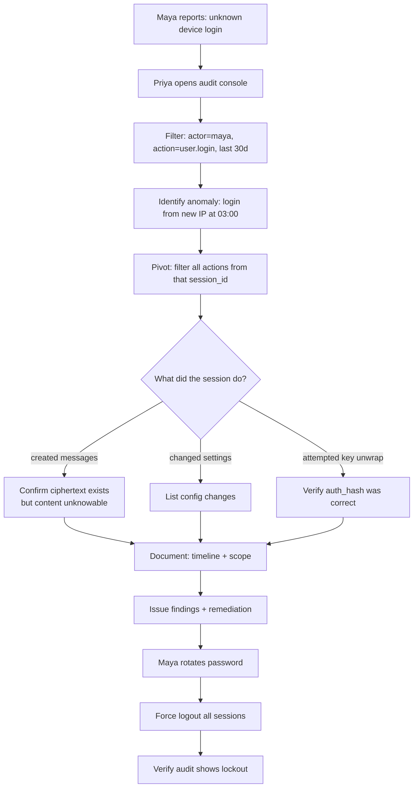

### 3.5 What Priya Can Prove (and What She Cannot)

**She can prove:**
- ✅ No admin actor performed `message.read` actions
- ✅ All key operations are logged with actor + timestamp
- ✅ Audit log is tamper-evident (hash chain valid)
- ✅ All API keys have scope + rate limits + expiry
- ✅ User access reviews happened on schedule
- ✅ Encryption is applied at message-write time (sample inspections show ciphertext only)
- ✅ Backup encryption keys are separate from app keys
- ✅ TLS 1.3 enforced (config audit)

**She cannot:**
- ❌ Read any message content (by cryptographic design)
- ❌ Compel server to decrypt (server has no decryption capability)
- ❌ Discover what users said even with subpoena, **unless escrow keys are configured** (policy decision)

### 3.6 Regulatory Mapping

| Regulation | Control | Evidence |
|------------|---------|----------|
| GDPR Art 32 | Encryption + pseudonymization | DB schema review + sample ciphertext |
| GDPR Art 17 | Right to erasure | `user.deleted` audit entries + ciphertext deletion check |
| GDPR Art 33 | Breach notification | Incident response runbook + drills |
| SOC 2 CC6.1 | Logical access controls | RBAC config + audit log of access reviews |
| SOC 2 CC6.7 | Restricted physical access | Cloud provider attestation |
| SOC 2 CC7.2 | System monitoring | Metrics + alerts evidence |
| HIPAA §164.312(a)(1) | Access control | Authentication logs |
| HIPAA §164.312(e)(1) | Transmission security | TLS config + cipher audit |
| ISO 27001 A.10 | Cryptography | This SECURITY.md + key management procedures |

---

## Cross-Persona Touchpoints

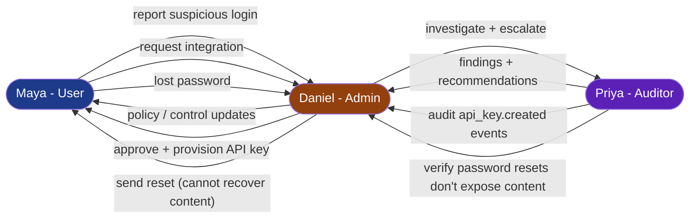

---

## UX Principles Across All Journeys

1. **Transparency about zero-knowledge.** Every irreversible action ("delete user", "reset password", "delete conversation") shows a clear warning about cryptographic finality.
2. **Recovery is opt-in.** Users explicitly choose recovery method on signup; no silent backdoors.
3. **Audit trails are first-class UX.** Every admin action shows "this will be logged as X" before confirmation.
4. **Status indicators everywhere.** Encryption state, connection health, sync status — always visible, never alarming.
5. **No surprise data exposure.** Anything visible to admin/auditor is documented in this file. New features must update this doc.

---

*User journeys for the GateForge Parrot — covering end users, admins, and auditors with zero-knowledge encryption as a first-class constraint.*
